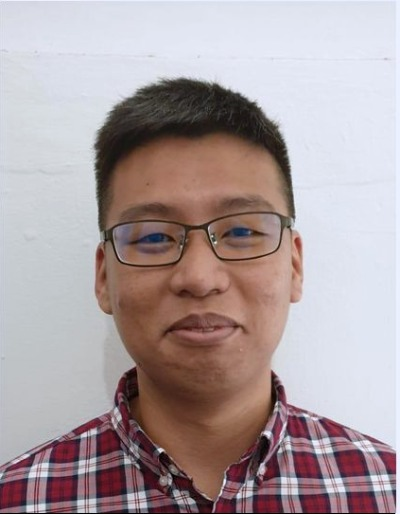
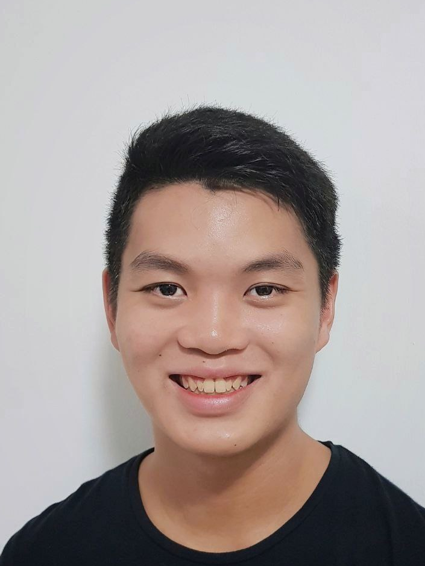

We are a team based in the [School of Computing, National University of Singapore](http://www.comp.nus.edu.sg).

## Project team

### Galvin Leow Wen Yuan

[[github](http://github.com/galvinleow)]
[[portfolio](team/galvinleow.md)]
You can reach me at the email `galvinleow@u.nus.edu`

* Role: Team Lead
* Responsibilities
    * Revenue Tracker Feature
        * Implementation
        * User Guide
        * Developer Guide
        * Testing
    * Use case for entire project

### Wei Kit Khoong

[[github](http://github.com/khoongwk)] 
[[portfolio](team/khoongwk.md)]
You can reach me at the email `e0014763@u.nus.edu`

* Role: Developer
* Responsibilities:
    * Appointment Manager Feature
        * Implementation
        * User Guide
        * Developer Guide
        * Testing
    * Documentation Master

### Chang Rui Feng

[[github](http://github.com/RuiFengg)]
[[portfolio](team/ruifengg.md)]
You can reach me at the email `ruifeng.chang@u.nus.edu`

* Role: Developer
* Responsibilities:
    * Client Manager Feature
        * Implementation
        * User Guide
        * Developer Guide
        * Testing
    * UI
            

### Hans Sebastian Tirtaputra

[[github](http://github.com/hansebastian)]
[[portfolio](team/hansebastian.md)]
You can reach me at the email `hans.sebastian@u.nus.edu`

* Role: Developer
* Responsibilities:
    * Service Manager Feature
        * Implementation
        * User Guide
        * Developer Guide
        * Testing
    * UI

### Tan Yan Lyn

[[github](https://github.com/yanlynnnnn)]
[[portfolio](team/yanlynnnnn.md)]
You can reach me at the email `e0424594@u.nus.edu`

* Role: Developer
* Responsibilities:
    * Expense Tracker Feature
        * Implementation
        * User Guide
        * Developer Guide
        * Testing
    * UI

