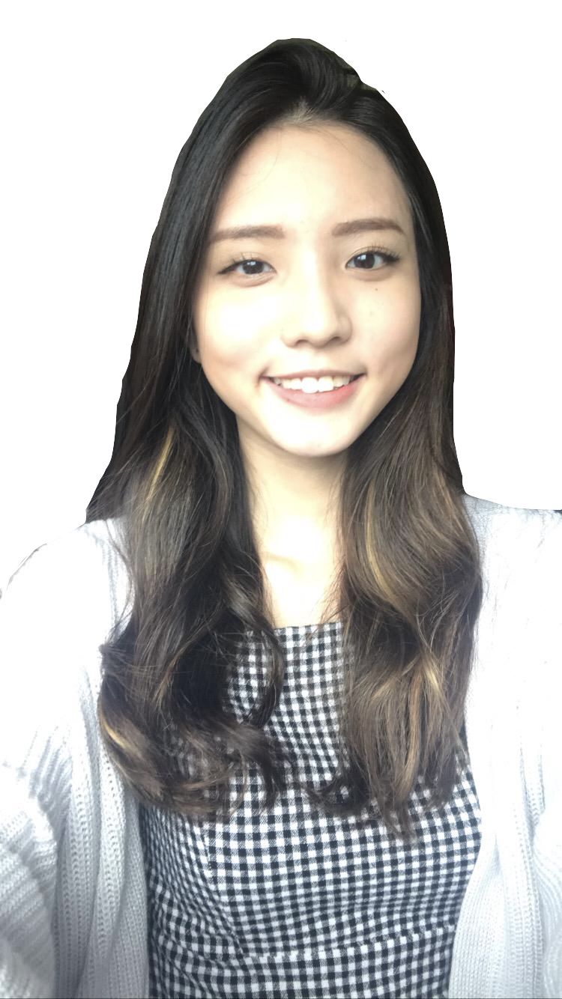

We are a team based in the [School of Computing, National University of Singapore](http://www.comp.nus.edu.sg).

You can reach us at the email `seer[at]comp.nus.edu.sg`

## Project team

### John Doe

[[homepage](http://www.comp.nus.edu.sg/~damithch)]
[[github](https://github.com/johndoe)]
[[portfolio](team/johndoe.md)]

* Role: Project Advisor

### Galvin Leow Wen Yuan

[[github](http://github.com/galvinleow)]
[[portfolio](team/galvinleow.md)]

* Role: Team Lead
* Responsibilities: UG, Scheduling

### Johnny Doe

[[github](http://github.com/johndoe)] [[portfolio](team/johndoe.md)]

* Role: Developer
* Responsibilities: Data

### Chang Rui Feng

[[github](http://github.com/RuiFengg)]
[[portfolio](team/ruifengg.md)]

* Role: Developer
* Responsibilities: Code quality

### Hans Sebastian Tirtaputra

[[github](http://github.com/hansebastian)]
[[portfolio](team/hansebastian.md)]

* Role: Developer
* Responsibilities: UI

### Tan Yan Lyn

[[github](https://github.com/yanlynnnnn)]
[[portfolio](team/yanlynnnnn.md)]

* Role: Developer
* Responsibilities: UI

