* Table of Contents
{:toc}

## 1. Introduction

**Homerce** is a desktop business management application meant for home-based beauty salon owners who want to consolidate all
the information related to their business, such as upcoming appointments, their list of clients, as well as profits recorded.
It focuses on the Command Line Interface (CLI) while providing users with a simple and clean Graphical User Interface (GUI).
Thus, the main interaction with **Homerce**. will be done through commands.

The features of Homerce include:
* Keeping track of existing/new clients.
* Scheduling of upcoming appointments with clients.
* Recording of revenue from services provided.
* Recording of business-related expenses.
* Calculation of business profit.

The purpose of this Developer Guide is to help you understand the design and implementation of **Homerce**,
so that you can get started on your contributions to **Homerce**.

## 2. Setting up

Refer to the guide [_Setting up and getting started_](SettingUp.md).

## 3. Design

This section will help you learn more about the design and structure of Homerce.

### 3.1 Architecture

The ***Architecture Diagram*** given below explains the high-level design of the Homerce. 

:bulb: **Tip:** The `.puml` files used to create diagrams in this document can be found in the [diagrams](https://github.com/se-edu/addressbook-level3/tree/master/docs/diagrams/) folder. Refer to the [_PlantUML Tutorial_ at se-edu/guides](https://se-education.org/guides/tutorials/plantUml.html) to learn how to create and edit diagrams.

The table below gives an overview of each component in Homerce. More details about each component can be found in the following subsections.

| Component | Overview |
|-----------|----------|
|**`Main`**| Has two classes called [`Main`](https://github.com/se-edu/addressbook-level3/tree/master/src/main/java/seedu/address/Main.java) and [`MainApp`](https://github.com/se-edu/addressbook-level3/tree/master/src/main/java/seedu/address/MainApp.java).   It is responsible for:   1. At app launch: Initializes the components in the correct sequence, and connects them up with each other.   2. At shut down: Shuts down the components and invokes cleanup methods where necessary.|
|**`Commons`**|Represents a collection of classes used by multiple other components.|
|**`UI`**|The UI of the App.|
|**`Logic`**|The command executor.|
|**`Model`**|Holds the data of the App in memory.|
|**`Storage`**|Reads data from, and writes data to, the hard disk.|

Each of the four components - `UI`, `Logic`, `Model`, and `Storage`,
* defines its *API* in an `interface` with the same name as the Component.
* exposes its functionality using a concrete `{Component Name}Manager` class (which implements the corresponding API `interface` mentioned in the previous point. For example, the `Logic` component defines its API in the `Logic.java` interface and exposes its functionality using the `LogicManager.java` class which implements the `Logic` interface.

**How the architecture components interact with each other**

The *Sequence Diagram* below shows how the components interact with each other for the scenario where the user issues the command `deletecli 1`.

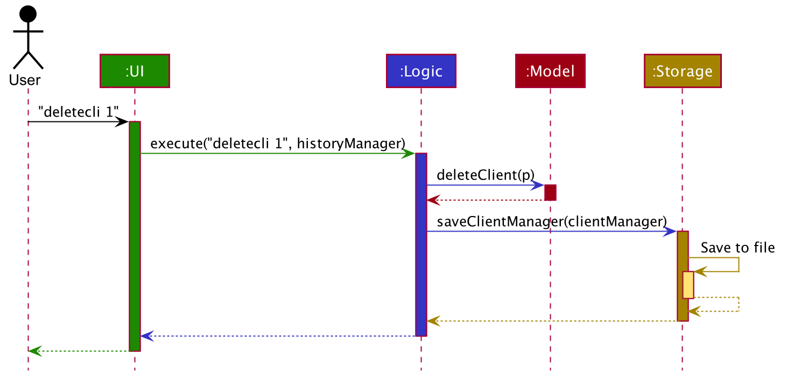

The sections below give more details of each component.

### 3.2 UI Component

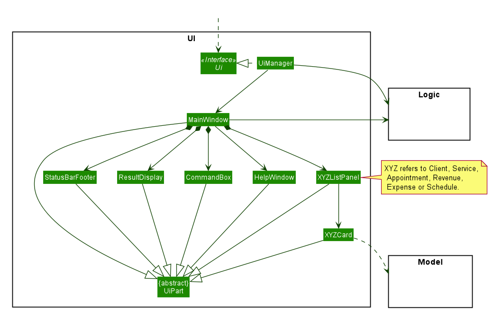

**API** :
[`Ui.java`](https://github.com/se-edu/addressbook-level3/tree/master/src/main/java/seedu/address/ui/Ui.java)

The UI consists of a `MainWindow` that is made up of parts e.g.`CommandBox`, `ResultDisplay`, `StatusBarFooter` etc. All these, including the `MainWindow`, inherit from the abstract `UiPart` class.

The `UI` component uses JavaFx UI framework. The layout of these UI parts are defined in matching `.fxml` files that are in the `src/main/resources/view` folder. For example, the layout of the [`MainWindow`](https://github.com/se-edu/addressbook-level3/tree/master/src/main/java/seedu/address/ui/MainWindow.java) is specified in [`MainWindow.fxml`](https://github.com/se-edu/addressbook-level3/tree/master/src/main/resources/view/MainWindow.fxml)

The `UI` component,

* Executes user commands using the `Logic` component.
* Listens for changes to `Model` data so that the UI can be updated with the modified data.

### 3.3 Logic Component

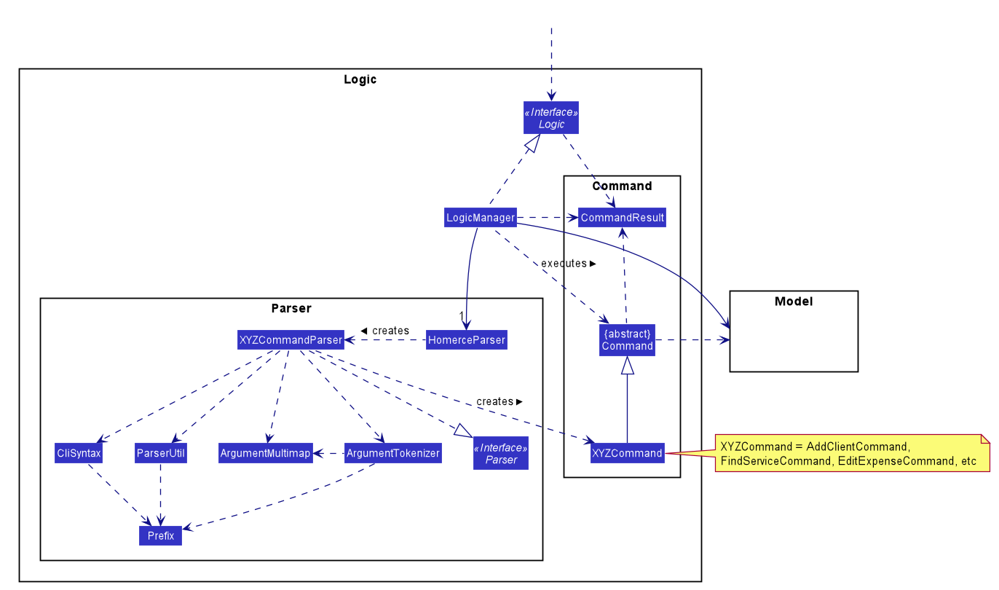

**API** :
[`Logic.java`](https://github.com/se-edu/addressbook-level3/tree/master/src/main/java/seedu/address/logic/Logic.java)

1. `Logic` uses the `HomerceParser` class to parse the user command.
1. This results in a `Command` object which is executed by the `LogicManager`.
1. The command execution can affect the `Model` (e.g. adding a client).
1. The result of the command execution is encapsulated as a `CommandResult` object which is passed back to the `Ui`.
1. In addition, the `CommandResult` object can also instruct the `Ui` to perform certain actions, such as displaying help to the user.

Given below is the Sequence Diagram for interactions within the `Logic` component for the `execute("delete 1")` API call.

:information_source: **Note:** The lifeline for `DeleteCommandParser` should end at the destroy marker (X) but due to a limitation of PlantUML, the lifeline reaches the end of diagram.

### 3.4 Model Component

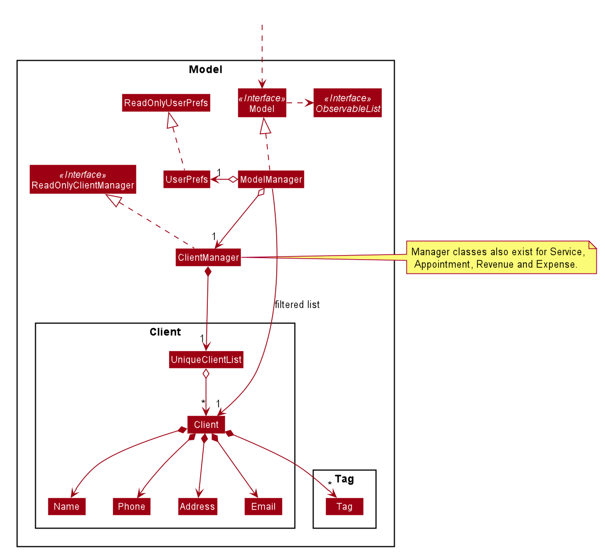

**API** : [`Model.java`](https://github.com/se-edu/addressbook-level3/tree/master/src/main/java/seedu/address/model/Model.java)

The `Model`,

* stores a `UserPref` object that represents the user’s preferences.
* stores the data in Homerce.
* exposes an unmodifiable `ObservableList<Client>` that can be 'observed' e.g. the UI can be bound to this list so that the UI automatically updates when the data in the list change.
* does not depend on any of the other three components.

:information_source: **Note:** An alternative (arguably, a more OOP) model is given below. It has a `Tag` list in the `Homerce`, which `Client` references. This allows `Homerce` to only require one `Tag` object per unique `Tag`, instead of each `Client` needing their own `Tag` object. 
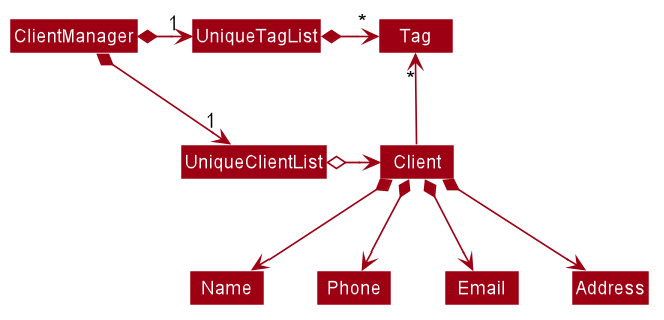

### 3.5 Storage Component

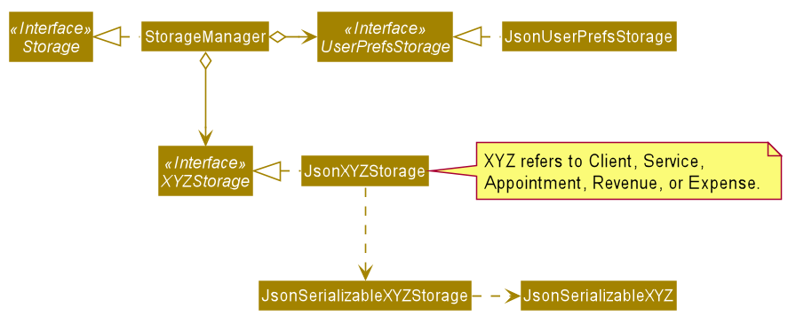

**API** : [`Storage.java`](https://github.com/se-edu/addressbook-level3/tree/master/src/main/java/seedu/address/storage/Storage.java)

The `Storage` component,
* can save `UserPref` objects in json format and read it back.
* can save the address book data in json format and read it back.

### 3.6 Common Classes

Classes used by multiple components are in the `seedu.homerce.commons` package.

--------------------------------------------------------------------------------------------------------------------

## 4. Implementation

This section describes some noteworthy details on how certain features are implemented.

### 4.1 List Managers

Homerce allows the user to manage different essential lists for his or her home-based beauty salon.

The different types of lists include:
1. Appointments list
2. Clients list
3. Services list

All these lists are managed by a `ListManager` which support basic [CRUD](#appendix-e-glossary) operations and some
additional operations depending on the different types of `ListManager`s. Additional operations include operations such as
`sort`. The term *item* will be used to refer to an element stored in a list.

Common commands for all list managers:
* `add` - Creates a new list item
* `edit` - Modifies an existing list item
* `delete` - Removes an existing item from the list
* `list` - Shows all items in the list
* `find` - Searches for item(s) in the list
* `clear` - Removes all the items in the list

#### 4.1.1 Rationale 

When running a home-based beauty salon, there are many things that the user needs to manage. The 3 lists stated above
are essential to every home-based beauty salon. That is why there are `ListManager`s to help the user manage the 3
lists so that they can run their home-based beauty salon effectively and efficiently. 

#### 4.1.2 Current Implementation

In this section, we will explain the structure of a `ListManager`.
As mentioned in this section's overview, the term *item* refers to an element stored in a list.

The `ListManager` contains a `UniqueList` which is a data structure that stores all the *items* of a list. The 
`UniqueList` uses Java's generics and contains items that implement the `UniqueListItem` interface. The uniqueness of
an *item* in the list is checked using the `isSame()` method of the `UniqueListItem` interface.

The `ListManager` also implements the `ReadOnlyManager` interface which has the `getList()` method. The `getList()` method
returns an `ObservableList` of *items*. For instance, `ServiceManager` implements `ReadOnlyServiceManager`. The
`ObservableList` of *items* allow listeners to track changes when they occur and reflect these changes to the graphical
user interface.

The following class diagram models the structure of the `ListManager`.

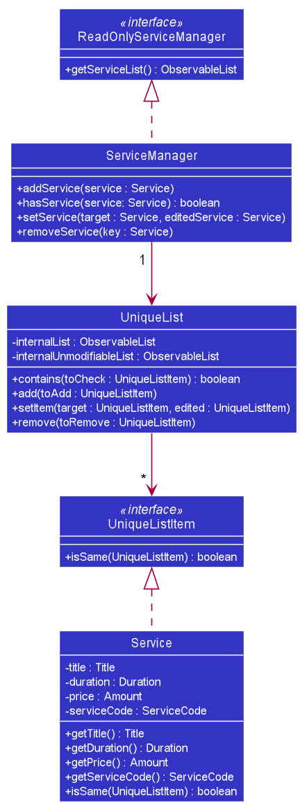 

*Figure 1. Structure of `ListManager`*

#### 4.1.3 Design Consideration 

**Aspect: Implementation of a `ListManager`**

|              | **Pros**   | **Cons** |
| -------------|-------------| -----|
| **Option 1 (current choice)**   Extract the common functionality of the   3 `ListManager`s into one generic `UniqueList` class.  The `UniqueList` class is used as the base data structure   and all 3 `ListManager`s build additional functionality on top of it. | Makes use of the Don't Repeat Yourself (DRY) principle which guards against duplication of information and minimizes repeated code.| All `ListManager`s will have dependencies on `UniqueList`. Implementation of all `ListManager`s will require `UniqueList` to be finished implementing first.|
| **Option 2**   Do not extract any common functionalities.| Each member can begin working on their own implementation of `ListManager` immediately and independently as there are no dependencies on a common `UniqueList`. | Violates DRY principle and results in a lot of repeated code and functionality|

Reason for choosing option 1:
* Follow good coding standards by applying design principles such as the DRY principle.
* Reduce total man-hours required to create each `ListManager` once the common dependency of `UniqueList` has been created.

### 4.2 List Trackers 

Homerce allows the user to keep track of different lists that stores the financial details of his or her home-based beauty salon.

The different types of lists include:
1. Expenses list
2. Revenue list

All these lists tracked by a `ListTracker`. The `ListTracker` for an expenses list will have additional `add`, `edit`,
and `delete` operations. The term *item* will be used to refer to elements stored in a list.

Common commands for all list managers:
* `sort` - Sorts the list by the given order
* `list` - Shows all items in the list
* `find` - Searches for item(s) in the list
* `clear` - Removes all the items in the list

#### 4.2.1 Rationale 

When running a home-based beauty salon, it is important to keep track of the financials of the business. The revenue and
expenses information are essential to any home-based beauty salon. That is why there are `ListTrackers`s to help the user manage 
the revenue and expenses lists so that they can keep track of their home-based beauty salon's profitability conveniently. 

#### 4.2.2 Current Implementation

In this section, we will explain the structure of a `ListTracker`.
As mentioned in this section's overview, the term *item* refers to an element stored in a list.

The `ListTracker` contains a `NonUniqueList` which is a data structure that stores all the *items* of a list. The 
`NonUniqueList` uses Java's generics and contains items that implement the `NonUniqueListItem` interface. 

The `ListTracker` also implements the `ReadOnlyTracker` interface which has the `getList()` method. The `getList()` method
returns an `ObservableList` of *items*. For instance, `RevenueTracker` implements `ReadOnlyRevenueTracker`. The
`ObservableList` of *items* allow listeners to track changes when they occur and reflect these changes to the graphical
user interface.

The following class diagram models the structure of the `ListTracker`.

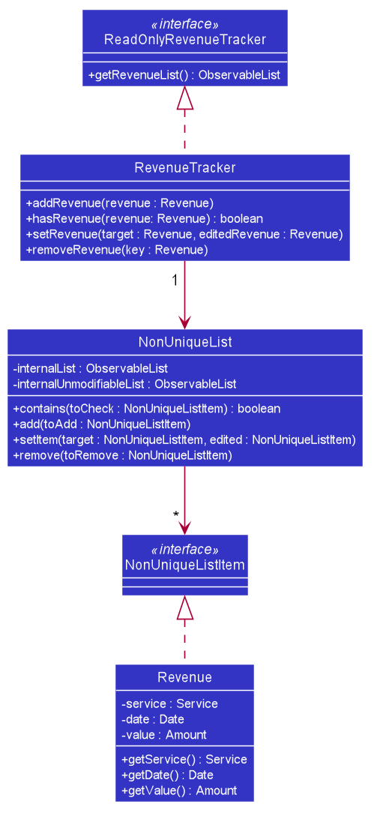

*Figure 2. Structure of `ListTracker`*

#### 4.2.3 Design Consideration 

**Aspect: Separating a `ListManager` from a `ListTracker`**

|              | **Pros**   | **Cons** |
| -------------|-------------| -----|
| **Option 1**   Make use of a `ListManager` to keep track of expenses and revenue as well | Reduces repeated code for certain functionalities such as `list`, `find` and `clear`. | A `ListManager` depends on a `UniqueList` which ensure that all *items* in the list are unique. However, revenue and expense entries may not be unique. This means that revenue and expense *item* entries can not be properly represented using a `ListManager`.|
| **Option 2 (current choice)**   Create a new `ListTracker` to keep track of expenses and revenue | Allows for a proper representation of non unique revenue and expense items in Homerce. | Some code will be repeated for certain common functionalities amongst `ListManager` and `ListTracker`.|

Reason for choosing option 2:
* Homerce needs to be able to add revenue and expense details for it to track the financials of the home-based beauty salon. This can only be done with a `ListTracker` which allows for non-unique list *items*.
* Using `ListTracker` with a dependency on `NonUniqueList` allows for a different implementation when comparing two *items* in the list.

**Aspect: Implementation of a `ListTracker`**

|              | **Pros**   | **Cons** |
| -------------|-------------| -----|
| **Option 1 (current choice)**   Extract the common functionality of the   3 `ListTracker`s into one generic `NonUniqueList` class.  The `NonUniqueList` class is used as the base data structure   and both `ListTracker`s build additional functionality on top of it. | Makes use of the Don't Repeat Yourself (DRY) principle which guards against duplication of information and minimizes repeated code.| Both `ListTracker`s will have dependencies on `NonUniqueList`. Implementation of both `ListTracker`s will require `NonUniqueList` to be finished implementing first.|
| **Option 2**   Do not extract any common functionalities.| Each member can begin working on their own implementation of `ListTracker` immediately and independently as there are no dependencies on a common `NonUniqueList`. | Violates DRY principle and results in a lot of repeated code and functionality|

Reason for choosing option 1:
* Follow good coding standards by applying design principles such as the DRY principle.
* Reduce total man-hours required to create each `ListTracker` once the common dependency of `NonUniqueList` has been created.

### 4.3 Service Manager 

Homerce allows the user to keep track of the services that his or her home-based business provides. The service manager is one of the `ListManager`s elaborated in [section 4.1](#41-list-managers).

#### 4.3.1 Rationale 

The service manager is essential to any home-based business that provides services for its customers. With many services to keep track of, we decided to create
a service manager to assist the user with the process of keeping track of all the services that his or her home-based business provides.

#### 4.3.2 Current Implementation

The current implementation of the service manager allows the user to keep track of a list of services that is provided by the home-based business. Each service
added into the list will have a unique service code to identify it. The service code will be automatically generated by Homerce when the user adds a new
service. 

In this section, we will use the following Activity Diagram to outline the generation of service code when the `addsvc` command of the service manager is executed.

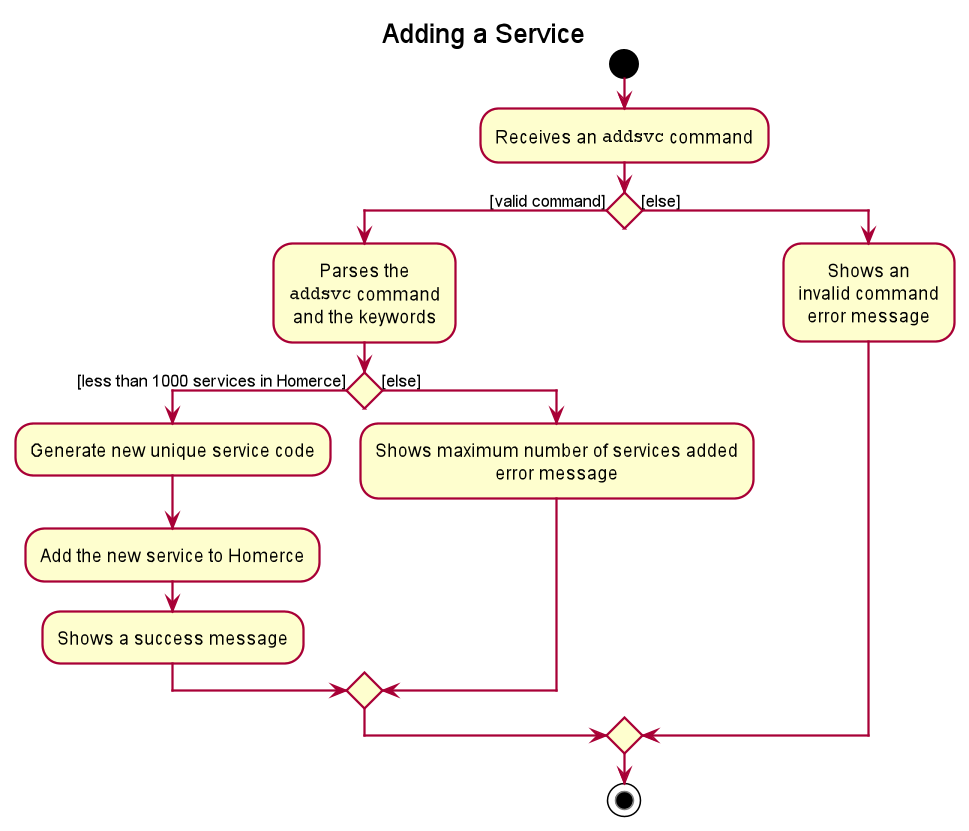

*Figure 3. Workflow of a `addsvc` command*

When the user enters the `addsvc` command to add a new service, the user input command undergoes the same command parsing as described in 
[Section 3.3 Logic Component](#33-logic-component). During the execution of `AddServiceCommand`, Homerce will check the existing service codes from the
services in both the list of services and appointments. From the existing list of service codes, Homerce will then generate the
next smallest service code ranging from "SC000" to "SC999". For example, if Homerce already has an existing list of services from the service or appointments list  with
service codes "SC000", "SC001", and "SC005", the next service code generated during the execution of `AddServiceCommand` would be
"SC002".

The following steps will describe the execution of the `AddServiceCommand` in detail, assuming that no errors are encountered.
1. When the `execute()` method of the `AddServiceCommand` is called, the `ModelManager`'s `getFilteredServiceList()` and `getFilteredAppointmentList()` method are called.
2. The `ModelManager` will return a list of services and appointments provided by Homerce to the `AddServiceCommand`.
3. The `ServiceCodeGenerator` will use the list of services and appointments provided and call the `generateServiceCode()` method.
4. The `ServiceCodeGenerator` will return a unique service code, which is assigned to the service being added.
5. The `Model` is updated to include the newly added service by calling the `addService()` method of the `ModelManager`, which proceeds to call the `addService()` method of the `ServiceManager`.
6. The `Ui` component will detect this change and update the GUI.
7. Assuming that the above steps are all successful, the `AddServiceCommand` will then create a `CommandResult` object and return the result.

The following Sequence Diagram summarises the aforementioned steps. 

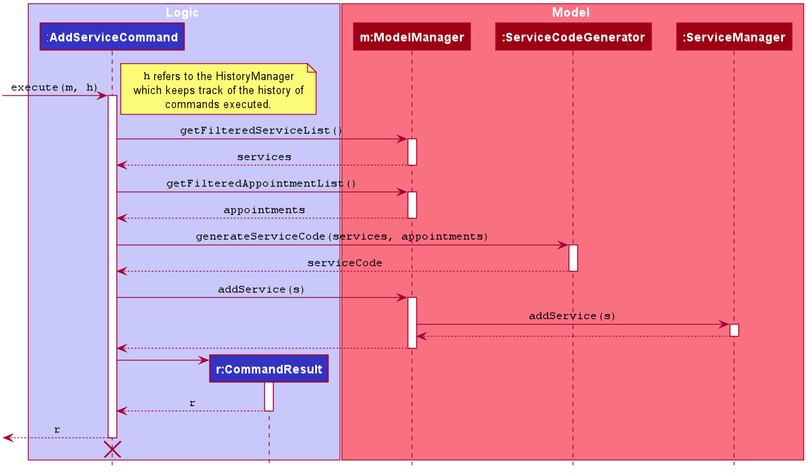

*Figure 4. Execution of an `addsvc` command*

#### 4.3.3 Design Consideration

**Aspect: Identifying each service with a unique service code**

|              | **Pros**   | **Cons** |
| -------------|-------------| -----|
| **Option 1**   Omit the use of service codes to identify a service. | Arguably more user-friendly to identify services by its title instead of a service code. | Unable to uniquely identify services, resulting in complications when executing commands which require services.   For example adding an appointment for a service "Manicure" when there are two "Manicure" services provided by Homerce but with different prices and durations. |
| **Option 2 (current choice)**   Tag each service with a unique service code. | Allows users to easily identify services uniquely. | Limits the number of services that can be added to Homerce depending on the format of the service code |

Reason for choosing option 2:
* It is important for users to be able to uniquely identify services the user may want to have multiple services with the same title, but with different prices or durations.
* The current format of a service code allows for 1000 unique services to be created since service codes are recycled when a service is deleted. This would be more than sufficient all home-based businesses to add all the services that they provide.

**Aspect: Service code generation**

|              | **Pros**   | **Cons** |
| -------------|-------------| -----|
| **Option 1**   Allow the user to select his or her own service code. | Gives the user more freedom to select a service code that suits the user's liking. | Unnecessary burden for the user to keep track of and select an unique service codes for each new service to be created.|
| **Option 2 (current choice)**   Automatically generate a service code for an added service. | Easier to ensure consistency in the format of service codes.   Relieves the burden of tracking and maintaining service codes from the user. | Service codes generated may not be intuitive for the user to easily remember. |

Reason for choosing option 2:
* If the user's home-based business has many services, automatic generation of service codes will provide a more seamless and convenient process when adding new services.
* The user can find services by title to determine it's unique service code, allowing the user to quickly identify a service's service code.

### 4.4 Client Manager

Homerce allows the user to keep track of the clients that his or her home-based business serves. The client manager is one of the `ListManager`s elaborated in [section 4.1](#41-list-managers).

#### 4.4.1 Rationale 

The client manager is essential to keep track of all the client's relevant details the home-based business has. With many clients to keep track of, we decided to create
a client manager so that the user can store and quickly get the information he/she needs about a certain client.

#### 4.4.2 Current Implementation

The current implementation of the client manager allows the user to keep track a list of clients for their home-based business. Users
have to include the name, phone and email for the client and ensure at least 2 of the fields specified are unique to avoid duplicate client entries.
Users have an option to add a tag to the client to better identify the client as well. 

In this section, we will use the following Activity Diagram to outline the filtering of the list when the `findcli` command of the client manager is executed.

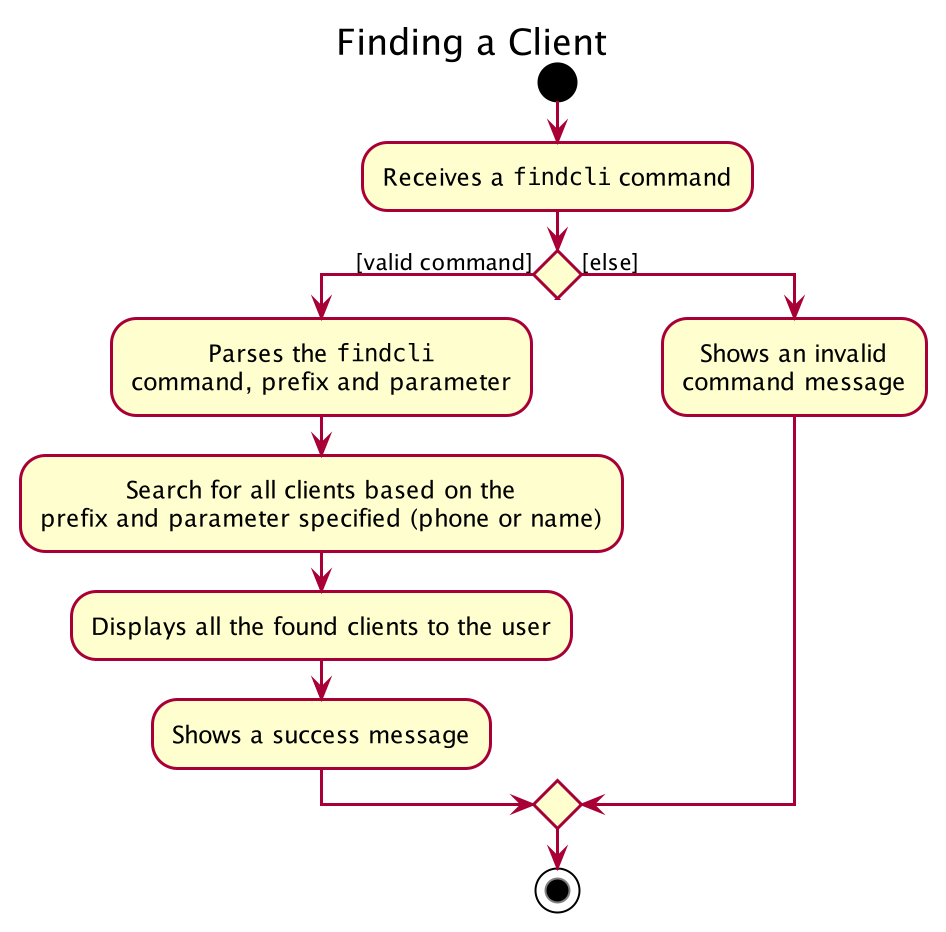

*Figure 5. Workflow of a `findcli` command*

When the user enters the `findcli` command to sort the client list, the user input command undergoes the same command parsing as described in
[Section 3.3 Logic Component](#33-logic-component). During the execution of `FindClientCommand`, Homerce will access the client manager
and filter the client list based on the predicate created when the user input gets parsed. 
 
The following steps will describe the execution of the `FindClientCommand` in detail, assuming that no errors are encountered.
1. When the `execute()` method of the `FindClientCommand` is called, the `Model`'s `updateFilteredClientList()` method is called.
2. The predicate gets checked against the client list in the model and filters the list accordingly.
3. The `FindClientCommand` returns a `CommandResult` with a success message
4. The `Ui` component will detect this change and update the GUI.

The following Sequence Diagram summarises the aforementioned steps. 

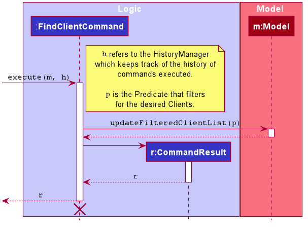

*Figure 6. Execution of an `findcli` command*

#### 4.4.3 Design Consideration 

**Aspect: FindClientCommand implementation**

|              | **Pros**   | **Cons** |
| -------------|-------------| -----|
| **Option 1**   Allow the user to find a client just by name without the use of any prefixes | Easier to implement and also more convenient for the user | Not consistent with the other commands that all have the use of prefixes and there might be clients with the same names|
| **Option 2 (current choice)**   Allow the user to find a client by phone number or name using prefixes. | Gives the user more freedom to find a client through relevant fields such as phone and name. | Does not allow for multiple prefix find. |

Reason for choosing option 2:
* It is more intuitive to the user where all commands have a similar format
* Users can have more flexibility when finding a client using phone or name.

### 4.5 Appointment Manager
Homerce allows the user to keep track of the appointments of his or her home-based business. The appointment manager is one of the `ListManager`s elaborated in [section 4.1](#41-list-managers).

#### 4.5.1 Rationale
The appointment manager is a core feature which enables tracking of all past and upcoming appointments the home-based business owner has.
With many appointments to keep track of, we decided to create an appointment manager so that the user can store and quickly get the information
he/she needs about a certain appointment.

#### 4.5.2 Current Implementation
The current implementation of the appointment manager allows the user to keep track a list of appointments for their home-based business. Users
have to include the date, time of day, client phone number, and service code for the appointment. The date and time specified must be such that
it does not clashing with another appointment to avoid clashing entries in the appointment schedule.

In this section, we will use the following Activity Diagram to outline what happens when the `done` command of the appointment manager is executed.

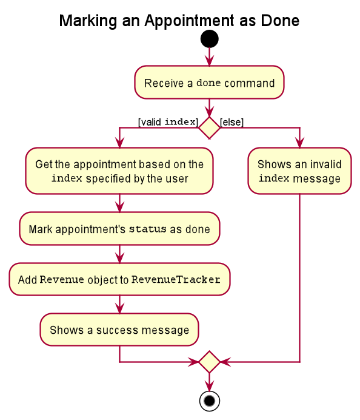

*Figure 7. Workflow of a `done` command*

When the user enters the `done` command to mark an appointment in the list as done, the user input command undergoes the same command parsing as described in
[Section 3.3 Logic Component](#33-logic-component). During the execution of `DoneAppointmentCommand`, Homerce will access the appointment manager to
get the appointment which matches the index specified. The appointment's `Status` is marked as done, and a `Revenue` entry
is created and stored in the Revenue Tracker.
 
The following steps will describe the execution of the `DoneAppointmentCommand` in detail, assuming that no errors are encountered.
1. When the `execute()` method of the `DoneAppointmentCommand` is called, the `Model`'s `getFilteredAppointmentList` method
is called to retrieve the current list of `Appointment`s.
2. Using the index supplied by the user, the appointment to be marked done is selected.
3. The `Appointment` is marked as done using the `markDone` method.
4. A new `Revenue` entry is created with the `Appointment`'s `Service` and `Date` supplied as parameters to the constructor.
5. The `Revenue` is added into the Revenue Tracker using the `Model`'s `addRevenue` method.
6. The list of `Appointment`s in the `Model` is updated and the schedule is refreshed using the `Model`'s `updateFilteredAppointmentList`
and `refreshSchedule` methods.
7. The `Ui` component will reflect these changes in the GUI.

The following Sequence Diagram summarises the aforementioned steps. 

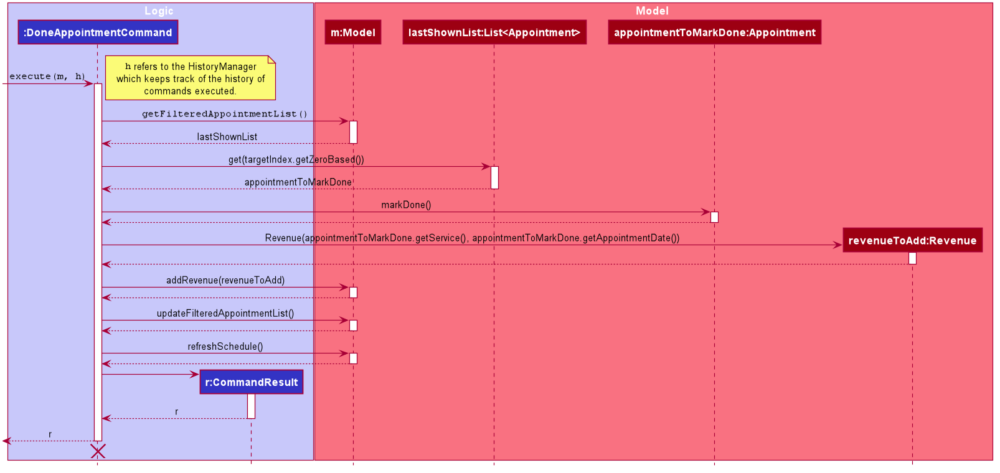

*Figure 8. Execution of an `done` command*

#### 4.5.3 Design Consideration
**Aspect: Revenue entries are created and deleted via `DoneAppointmentCommand` and `UnDoneAppointmentCommand`**

|              | **Pros**   | **Cons** |
| -------------|-------------| -----|
| **Option 1**   Allow the user to add, delete and edit revenue attached to an appointment independently, using revenue-related commands. | Flexibility is given to the user to customize how revenues are recorded while the home-based business is run.  | Revenues may not be in sync up with the appointments which are marked as done. Users who are not mindful might end up being confused by conflicting data in both the appointment tab and revenue tab. |
| **Option 2 (current choice)**   Revenue entries in the revenue tracker are only created or deleted by the `DoneAppointmentCommand` and `UnDoneAppointmentCommand`. Editing of revenue entries are not allowed.| Revenue entries are guaranteed to be added only when appointments are marked as done, which improves consistency. | Increased coupling of classes between `Appointment` class and `Revenue` class. |

Reason for choosing option 2:
* It is more intuitive to the user when Homerce automatically adds/removes the revenue associated with an appointment the moment the latter is marked as done/undone.
* Prevention of situations where a revenue entry is modified in the revenue tracker but not reflected in the associated appointment.

**Aspect: Sorting of appointments by chronological order is done whenever there are modifications to `UniqueAppointmentList`**

|              | **Pros**   | **Cons** |
| -------------|-------------| -----|
| **Option 1**   Implement a `PriorityQueue` that is fits the observer design pattern similar to `ObservableList` in the JavaFX library. | Better performance as the data structure for the list of appointments is optimized to be chronologically ordered whenever changes are made. | High technical knowledge and effort required to implement the data structures when time could be better used to develop and test other features.|
| **Option 2 (current choice)**   `FXCollections` library is used to sort the `ObservableList` of appointments, using a `Comparator` object. | No need for huge modifications to the generic `UniqueList`. Convenient usage of built-in library. | Higher number of internal computations as sorting is done for every change to the list of appointments. Might not scale well for large number of appointments (n > 1000)|

Reason for choosing option 2:
* The effort needed to implement option 1 is too great to justify the improvements in performance.
* Use of well-tested libraries like `FXCollections` lowers the chance making mistakes during the implementation of this feature. 

### 4.6 Revenue Tracker

Homerce allows the user to keep track of the revenues that his or her home-based business earned. The revenue tracker is one of the `ListTracker`s elaborated in [section 4.2](#42-list-trackers).

#### 4.6.1 Rationale

The revenue tracker is essential to keep track of the operational revenues of any home-based business. With many revenues to keep track of, we decided to create
a revenue tracker to assist the user with the process of keeping track of all the revenues that his or her home-based business earned.

#### 4.6.2 Current Implementation

The current implementation of the revenue tracker allows the user to keep track of a list of revenues earned by the home-based business.
The revenues will be categorized based on the service provided and it will be used in `breakdownfinance` in [section 4.8](#48-finance-breakdown). 

**Sort Revenue**

In this section, we will use the following Activity Diagram to outline the sorting of the revenue list when the `sortrev` command of the revenue tracker is executed.

*Figure 11. Workflow of a `sortrev` command*

When the user enters the `sortrev` command to sort the revenue list, the user input command undergoes the same command parsing as described in
[Section 3.3 Logic Component](#33-logic-component). During the execution of `SortRevenueCommand`, Homerce will access the revenue tracker
and sort the revenue list based on the value of the revenues. For example, if the user specifies the order as "asc", the revenue list will
be sorted in ascending order based on value, from lowest to highest value.

The following steps will describe the execution of the `SortRevenueCommand` in detail, assuming that no errors are encountered.
1. When the `execute()` method of the `SortRevenueCommand` is called, the `ModelManager`'s `getRevenueTracker()` method is called.
1. The `ModelManager` will return the existing `ReveneueTracker` to the `SortRevenueCommand`.
1. The `ModelManager` will call the `sort(isAsceding)` method on the `RevenueTracker`.
1. The `RevenueTracker` then calls the `sort(isAscending)` method on `NonUniqueList`, which sorts the revenue list based on the order specified.
1. The `ObservableList` of revenues is updated to reflect the newly sorted list.
1. The `Ui` component will detect this change and update the GUI.
1. Assuming that the above steps are all successful, the `SortRevenueCommand` will then create a `CommandResult` object and return the result.

The following Sequence Diagram summarises the aforementioned steps. 

*Figure 12. Execution of an `sortrev` command*

 

**Clear Revenue**

In this section, we will use the following Activity Diagram to outline the clearing of the revenue list when the `clearrev` command of the revenue tracker is executed.

*Figure 11. Workflow of a `clearrev` command*

When the user enters the `clearrev` command to sort the revenue list, the user input command undergoes the same command parsing as described in
[Section 3.3 Logic Component](#33-logic-component). During the execution of `ClearRevenueCommand`, Homerce will access the revenue tracker
and clear the revenue list. For example, if there are 5 entries in the list, all the revenues will be cleared.

The following steps will describe the execution of the `ClearRevenueCommand` in detail, assuming that no errors are encountered.
1. When the `execute()` method of the `ClearRevenueCommand` is called, the `ModelManager`'s `setRevenues()` method is called.
1. The `RevenueTracker` then calls the `setItems()` method on `NonUniqueList`, which set the revenue entries in the revenue list.
1. The `ObservableList` of revenues is updated to reflect the newly sorted list.
1. The `Ui` component will detect this change and update the GUI.
1. Assuming that the above steps are all successful, the `ClearRevenueCommand` will then create a `CommandResult` object and return the result.

The following Sequence Diagram summarises the aforementioned steps. 

*Figure 12. Execution of an `clearrev` command*

#### 4.6.3 Design Consideration

**Sort Revenue**

**Aspect: Sorting of revenues by value is executed whenever `sortrev` is done**

|              | **Pros**   | **Cons** |
| -------------|-------------| -----|
| **Option 1**   Implement a `PriorityQueue` that is fits the observer design pattern similar to `ObservableList` in the JavaFX library. | Better performance as the data structure for the list of appointments is optimized to be chronologically ordered whenever changes are made. | High technical knowledge and effort required to implement the data structures when time could be better used to develop and test other features.|
| **Option 2 (current choice)**   `FXCollections` library is used to sort the `ObservableList` of appointments, using a `Comparator` object. | No need for huge modifications to the generic `NonUniqueList`. Convenient usage of built-in library. | Higher number of internal computations as sorting is done for every change to the list of appointments. Might not scale well for large number of appointments (n > 1000)|

Reason for choosing option 2:
* The effort needed to implement option 1 is too great to justify the improvements in performance.
* Use of well-tested libraries like `FXCollections` lowers the chance making mistakes during the implementation of this feature. 

**Clear Revenue**

**Aspect: Clear all revenue entries from revenue list when `clearrev` is called**

|              | **Pros**   | **Cons** |
| -------------|-------------| -----|
| **Option 1**   Retrieve the revenue list and run build it arraylist clear method | Convenient usage of built-in Java method. | Performance might be slow when there is a huge data set. |
| **Option 2 (current choice)**   Creates a new empty list to replace the current list | Convenient usage of`NonUniqueList` method. Implementation effort is minimum. | A totally new object have to be created. |

Reason for choosing option 2:
* The effort needed to implement option 1 is too great.
* Performance will be improved when having big data set.

### 4.7 Expense Tracker

Homerce allows the user to keep track of the expenses that his or her home-based business incurs. The expense tracker is one of the `ListTracker`s elaborated in [section 4.2](#42-list-trackers).

#### 4.7.1 Rationale 

The expense tracker is essential to keep track of the operational expenses of any home-based business. With many expenses to keep track of, we decided to create
an expense tracker to assist the user with the process of keeping track of all the expenses that his or her home-based business incurs.

#### 4.7.2 Current Implementation

The current implementation of the expense tracker allows the user to keep track of a list of expenses incurred by the home-based business. Users can specify the
description, value, and date of the expense. Users can add an optional tag to categorize the expense, which will be used in `breakdownfinance` in [section 4.8](#48-finance-breakdown). 
In addition, the user can indicate if the expense is a fixed expense that recurs monthly, or if it is a one-time expense. Fixed expenses will be automatically recorded by Homerce
every month.

In this section, we will use the following Activity Diagram to outline the sorting of the expense list when the `sortexp` command of the expense tracker is executed.

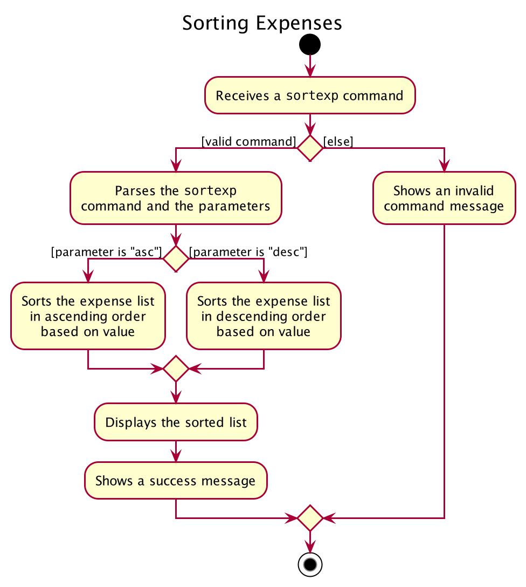

*Figure 11. Workflow of a `sortexp` command*

When the user enters the `sortexp` command to sort the expense list, the user input command undergoes the same command parsing as described in
[Section 3.3 Logic Component](#33-logic-component). During the execution of `SortExpenseCommand`, Homerce will access the expense tracker
and sort the expense list based on the value of the expenses. For example, if the user specifies the order as "asc", the expense list will
be sorted in ascending order based on value, from lowest to highest value.

The following steps will describe the execution of the `SortExpenseCommand` in detail, assuming that no errors are encountered.
1. When the `execute()` method of the `SortExpenseCommand` is called, the `ModelManager`'s `getExpenseTracker()` method is called.
2. The `ModelManager` will return the existing `ExpenseTracker` to the `SortExpenseCommand`.
3. The `ModelManager` will call the `sort(isAsceding)` method on the `ExpenseTracker`.
4. The `ExpenseTracker` then calls the `sort(isAscending)` method on `NonUniqueList`, which sorts the expense list based on the order specified.
5. The `ObservableList` of expenses is updated to reflect the newly sorted list.
6. The `Ui` component will detect this change and update the GUI.
7. Assuming that the above steps are all successful, the `SortExpenseCommand` will then create a `CommandResult` object and return the result.

The following Sequence Diagram summarises the aforementioned steps. 

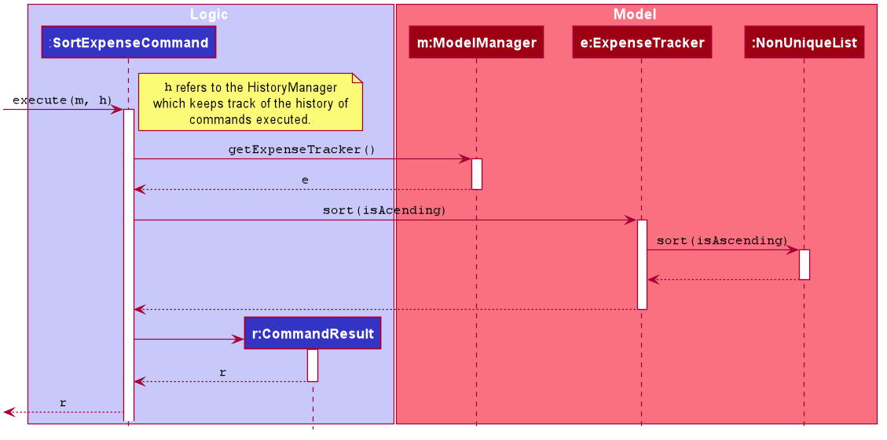

*Figure 12. Execution of an `sortexp` command*

#### 4.7.3 Design Consideration 

**Aspect: Duplicating a fixed expense every month**

|              | **Pros**   | **Cons** |
| -------------|-------------| -----|
| **Option 1**   Immediately create 12 duplicate expenses upon the creation of a fixed expense for the next 12 months, creating another 12 duplicate expenses after every 12 months. | Users can edit the fixed expense records in a period of 12 months by editing any one of the 12 duplicate expenses. | Users are unable to create a fixed expense that only recurs over a period of less than 12 months.   For example, a user might want to add a fixed expense that he will incur only for the next 6 months. However, the application will create 12 duplicate expenses in advance. |
| **Option 2 (current choice)**   Create one duplicate expense for each fixed expense per month. | Duplicate expenses are only recorded when the month comes or the month has passed. | Users can only edit the next duplicate expense by editing the most recent duplicate expense. |

Reason for choosing option 2:
* It is more intuitive to the user to record an expense only when it has been incurred.
* Users can have more flexibility in creating fixed expenses that recur for a period that is not a multiple of 12 months.

**Aspect: Duplicating a fixed expense on the date of the month it was created every month**

|              | **Pros**   | **Cons** |
| -------------|-------------| -----|
| **Option 1**   Duplicate all fixed expenses on the 1st of every month. | Duplicate expenses will be created all together at one shot, making it easier for users to keep track of his fixed expenses. | The `breakdownfinance` command for the month, when entered before the end of the month, might include duplicate expenses that have not yet been incurred.   For example, if the user enters the `breakdownfinance` command in the middle of the month, it will take into account duplicate expenses that are only paid for only at the end of the month, such as the air-conditioning bill. |
| **Option 2 (current choice)**   Duplicate each fixed expense on the exact date of the month it was created. | Duplicate expenses are only recorded on the date of the month they have been incurred, such that they will not be included in the `breakdownfinance` analysis when the command is entered before the end of the month.  | It may be difficult for the user to keep track of individual duplicate expenses as they are created one by one. |

Reason for choosing option 2:
* The expense should only be duplicated on the day of the month it has been incurred for better accounting purposes
* The `breakdownfinance` command analysis should not include duplicate expenses that have not yet been incurred.

### 4.8 Finance Breakdown

Homerce allows the user to keep track of the expenses and revenue for his or her home-based business. The finance breakdown 
will provide a breakdown of the monthly expenses and revenue based on tags for expenses and services for revenue. The finance breakdown will also 
calculate profits based on the monthly expenses and revenue.

#### 4.8.1 Rationale 

Keeping track of the financials of a home-based business is important for the business owner to make better financial decisions such as reducing certain expenses or 
increasing revenue by prioritizing certain services. This could potentially increase the profits of the home-based business. 
Thus, the finance breakdown is useful in helping the user view the financial information of the home-based business in a 
simpler way as monthly expenses and revenue will be categorized and profits will also be calculated automatically.

#### 4.8.2 Current Implementation

The current implementation of the finance breakdown makes use of the list of revenue and expenses as tracked by `RevenueTracker` and `ExpenseTracker`.
The list of revenue and expenses will be filtered by their `Month` and `Year` attribute as indicated by the user. The filtered list will
be used to create a breakdown of expenses and revenue, as well as to calculate the monthly profit of the home-based business.

In this section, we will outline the `breakdownfinance` command using the following Activity Diagram.

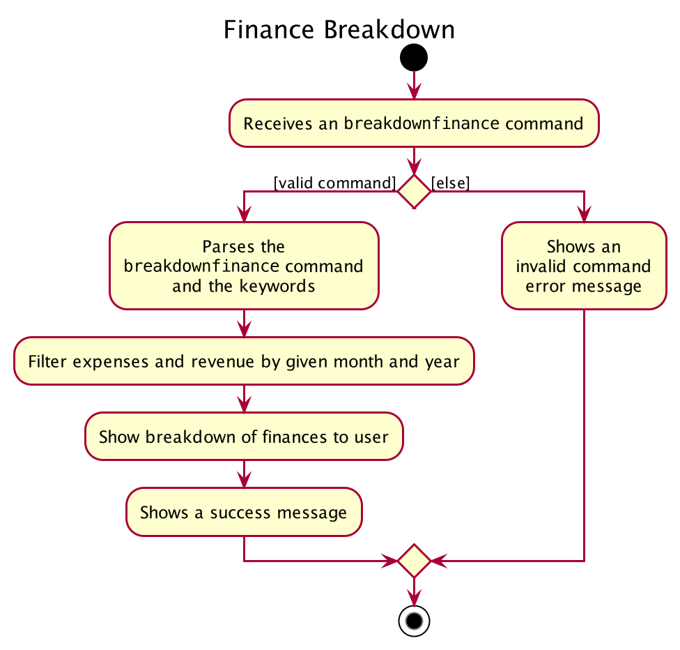

*Figure 13. Workflow of a `breakdownfinance` command*

When the user enters the `breakdownfinance` command to view the monthly breakdown, the user input command undergoes the same command parsing as described in 
[Section 3.3 Logic Component](#33-logic-component). During the execution of `breakdownfinance`, 

The following steps will describe the execution of the `BreakdownFinanceCommand` in detail, assuming that no errors are encountered.
1. When the `execute()` method of the `BreakdownFinanceCommand` is called, a new `ExpenseMonthYearPredicate` and `RevenueMonthYearPredicate` is created with the parsed `Month` and `Year`.
2. The `ModelManager`'s `updateFilteredExpenseList()` and `updateFilteredRevenueList()` method is called using the `ExpenseMonthYearPredicate` and `RevenueMonthYearPredicate` respectively.
3. The `Model`'s list of expenses and revenue is updated to contain only the expenses and revenue in the inputted `Month` and `Year`.
4. The `Ui` component will detect this change and update the GUI by opening a pop-up window to show the financial breakdown information.
5. Assuming that the above steps are all successful, the `BreakdownFinanceCommand` will then create a `CommandResult` object and return the result.

The following Sequence Diagram summarises the aforementioned steps. 

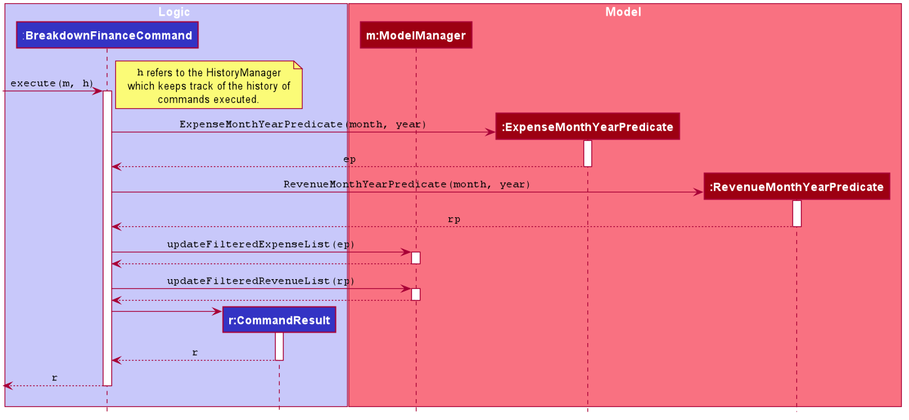

*Figure 14. Execution of an `breakdownfinance` command*

#### 4.8.3 Design Consideration

**Aspect: Which class to store Homerce's financial information**

|              |  **Pros**  | **Cons** |
| -------------|------------|----------|
| **Option 1 (current choice)**   Use revenue and expenses from `RevenueTracker` and `ExpenseTracker`   in the `BreakdownFinance` command. Do not create a new `FinanceTracker` class | Avoids duplication of code as the same list of expenses and services are used in `ExpenseTracker` and `RevenueTracker`| Increases coupling between `BreakdownFinanceCommand` code and `RevenueTracker` as well as `ExpenseTracker`|
| **Option 2**   Place the revenue and expenses as fields in a new `FinanceTracker` class | Provides more freedom for manipulation of revenue and expense data as `FinanceTracker` maintains a separate state for the list of expenses and revenue. | Violates the Don't Repeat Yourself(DRY) principle as the information for `ExpenseTracker` and `RevenueTracker` is duplicated in a new `FinanceTracker` class|

Reason for choosing option 1:
* Using the same instance of `ExpenseTracker` and `RevenueTracker` to obtain the list of expenses and revenue ensures that expenses and revenue data are consistent without needing to update the lists in `ExpenseTracker`, `RevenueTracker` as well as `FinanceTracker`.
* The `execute()` command of `BreakdownFinanceCommand` already takes in the `Model` which has `ExpenseTracker` and `RevenueTracker` as attributes. It is unnecessary to create a new `FinanceTracker` class as an attribute for `Model` to store and duplicate information that already exists.

### 4.9 Undo Previous Command

Homerce allows the user to undo previous commands to restore the state of Homerce to before the execution of the command.

#### 4.8.1 Rationale 

There may be situations where the user unintentionally uses a command that was not intended. In these situations, it is very useful
to allow the user to restore the previous state of the application, making it easy for the user to recover from accidental
command errors.

#### 4.8.2 Current Implementation

The current implementation of undo makes use of a `HistoryManager`. A `HistoryManager` maintains a `History` list, where
each `History` object holds a particular state of the `Model` and `Command` that was executed to change the state of that
`Model`. When the user executes the `undo` command, the `HistoryManager` will give the previous `History` of Homerce,
and `Model#replaceModel()` will be called to update the current state of Homerce to the previous `Model` in the `History`.

In this section, we will show an example usage scenario and how the `undo` mechanism behaves at each step:

Step 1: The user launches the application for the first time. The `HistoryManager` will be initialized with an empty list of histories.

Step 2: The user executes `deletesvc 5` command to delete the 5th service in Homerce's service list. When the `LogicManager`
executes the `CommandResult` from `DeleteServiceCommand`, `LogicManager#execute()` will call `HistoryManager#addToHistory()`,
causing the state initial state of the `Model` prior to the execution of `deletesvc 5` to be saved in the `History` of
`HistoryManager`.

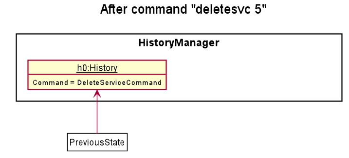

*Figure 15. State HistoryManager after `deletesvc 5` command*

Step 3: The user executes `deletecli 5` command to delete the 5th person in Homerce's client list. When the `LogicManager`
executes the `CommandResult` from `DeleteClientCommand`, `LogicManager#execute()` will call `HistoryManager#addToHistory()`,
causing the state initial state of the `Model` prior to the execution of `deletecli 5` to be saved in the `History` of
`HistoryManager`.

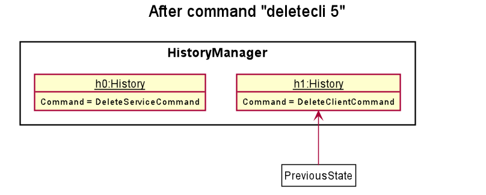

*Figure 16. State HistoryManager after `deletecli 5` command*

Step 4: The user now decides that deleting the client was a mistake, and decides to undo that action by executing the `undo`
command. The `undo` command will call `HistoryManager#getPreviousHistory()`, which will return the `History` object which stores
the previous state of Homerce's `Model`, as well as the command that caused the change of the previous state to the current one.
The current state of Homerce's `Model` will be updated to the state of the `Model` in the `History` object from the `HistoryManager`.

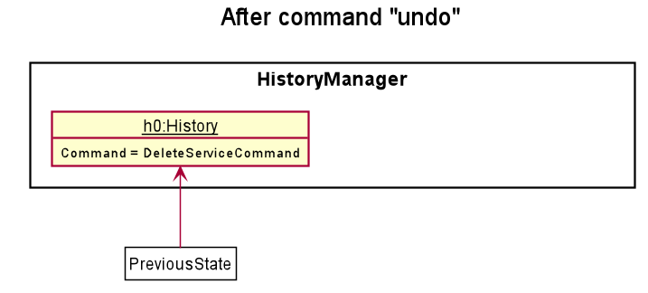

*Figure 17. State HistoryManager after `undo` command*

#### 4.8.3 Design Consideration

**Aspect: How undo executes**

|              |  **Pros**  | **Cons** |
| -------------|------------|----------|
| **Option 1 (current choice)**   Saves the entire model. | Easy to implement. | May have performance issues in terms of memory usage. |
| **Option 2**   Individual command knows how to undo itself. | Will use less memory (e.g. for `deletecli`, just save the client being deleted). | We must ensure that the implementation of each individual command are correct. |

Reason for choosing option 1:
* Saving the entire model allows the undo feature to be easily extendable to future addition of new commands that change the state of the model in different ways. 

## 5. Documentation
Refer to the guide [here](Documentation.md).

## 6. Logging
Refer to the guide [here](Logging.md).

## 7. Testing
Refer to the guide [here](Testing.md).

## 8. Configuration
Refer to the guide [here](Configuration.md).

## 9. Dev-ops
Refer to the guide [here](DevOps.md).

## Appendix A: Product Scope

**Target user profile**:
* Independent home-based business owner.
* Has little knowledge of business management software.
* Prefers to have relevant business components in a single application.
* Is a fast typist.
* Prefers typing over using mouse input.

**Value proposition**:
* Consolidates everything a home-based business needs such as appointments, clients, expenses, revenue and services into one place
* Saves significant time for the business owner, who previously had to manage details across his/her contacts, excel sheets, and inventory notebooks.
* Does not require extensive technical knowledge compared to other business management software.
* Displays expenses and revenue in a simple format for users to view.

## Appendix B: User Stories

Priorities: High (must have) - `* * *`, Medium (nice to have) - `* *`, Low (unlikely to have) - `*`

| Priority | As a …​                                          | I want to …​                                                                                                             | So that I can…​                                                                                                      |
| -------- | ----------------------------------------------- | ----------------------------------------------------------------------------------------------------------------------- | ------------------------------------------------------------------------------------------------------------------- |
| `* * *`  | Meticulous home-based beauty salon owner        | Keep track of my total monthly revenue                                                                                  | Have a good idea of how my business is doing                                                                        |
| `* * *`  | Budget-minded home-based beauty salon owner     | Keep track of my total monthly business-related expenses                                                                | Adjust the pricing of my services accordingly                                                                       |
| `* * *`  | Business-minded home-based beauty salon owner   | Keep track of my total monthly profit                                                                                   | Understand if my business is profitable and if it falls within a healthy profit margin                              |
| `* * *`  | Forgetful home-based beauty salon owner         | Find a service based on its name/keyword                                                                                | Easily refer to the price/duration of the service to answer client queries                                          |
| `* * *`  | Home-based beauty salon owner                   | Edit a service                                                                                                          | Change details about a specific service accordingly, such as adjusting the price/duration                           |
| `* * *`  | Home-based beauty salon owner                   | Delete a service                                                                                                        | Remove a service that I am no longer offering                                                                       |
| `* * *`  | Home-based beauty salon owner                   | Add a service                                                                                                           | Enter a new service that I recently decided to offer                                                                |
| `* * *`  | Home-based beauty salon owner                   | List my services                                                                                                        | View all the services that I am currently offering                                                                  |
| `* * *`  | Organized home-based beauty salon owner         | Keep track of all my clients                                                                                            | To find my clients easily when I want to contact them                                                               |
| `* * *`  | Home-based beauty salon owner                   | Add a client                                                                                                            | Record a new client that has not visited my salon before                                                            |
| `* * *`  | Home-based beauty salon owner                   | Edit a client                                                                                                           | Change details about a specific client, such as their new contact information                                       |
| `* * *`  | Home-based beauty salon owner                   | Find a client by their name or phone number                                                                             | Determine if the client has visited my salon before, and find their contact details from their name or vice versa   |
| `* * *`  | Organized home-based beauty salon owner         | Keep track of all my appointments, including the date and time of the appointment, service provided, and client served, | Organize my work schedule and avoid double-booking of appointments                                                  |
| `* * *`  | Home-based beauty salon owner                   | Add an appointment                                                                                                      | Enter a new appointment made into my appointment schedule                                                           |
| `* * *`  | Home-based beauty salon owner                   | Edit an appointment                                                                                                     | Change appointment details, such as date/time if the appointment is postponed                                       |
| `* * *`  | Home-based beauty salon owner                   | Delete an appointment                                                                                                   | Remove an appointment from my schedule if the client cancels or does not turn up                                    |
| `* * *`  | Forgetful home-based beauty salon owner         | Find an appointment                                                                                                     | Easily refer to the appointment details to answer client queries                                                    |
| `* * *`  | Home-based beauty salon owner                   | Mark an appointment as done                                                                                             | Add a record for revenue earned from that appointment                                                               |
| `* * *`  | Home-based beauty salon owner                   | List my revenues                                                                                                        | View all the revenue entries that I have                                                                            |
| `* * *`  | Forgetful home-based beauty salon owner         | Find a revenue                                                                                                          | See exactly how much revenue a certain type of service is bringing in                                               |
| `* *`    | Home-based beauty salon owner                   | Add an expense                                                                                                          | Record a new expense that I have made                                                                               |
| `* *`    | Home-based beauty salon owner                   | Tag my expense                                                                                                          | Organise my expenses according to the categories they fall under, such as an expense related to a particular service|
| `* *`    | Home-based beauty salon owner                   | Edit an expense                                                                                                         | Change the details of an expense, in the case that I input the wrong price/description of the expense               |
| `* *`    | Home-based beauty salon owner                   | Delete an expense                                                                                                       | Remove an expense that I may have added mistakenly                                                                  |
| `* *`    | Home-based beauty salon owner                   | Sort my expenses based on their price                                                                                   | Have an idea of which expenses incur the most/least cost to my business                                             |
| `* *`    | Home-based beauty salon owner                   | List my expenses                                                                                                        | View all the expense entries that I have                                                                            |
| `*    `  | Busy home-based beauty salon owner              | Have a built-in help guide                                                                                              | Familiarize myself with the application quickly                                                                     |
| `*    `  | Home-based beauty salon owner                   | Clear all the information in the application                                                                            | Restart all my beauty salon related records from scratch                                                            |
| `*    `  | Prudent home-based beauty salon owner           | Have a breakdown of my total monthly expenses based on the type of expense                                              | Minimize my expenditure on certain types of expenses                                                                |
| `*    `  | Resourceful home-based beauty salon owner       | Have a breakdown of my total monthly revenue based on the type of service provided                                      | Have an idea of which services generate more revenue and adjust the services I provide accordingly                  |

## Appendix C: Use Cases

(For all use cases below, the **System** is `Homerce` and the **Actor** is the `user`, unless specified otherwise)

### Services Management

<pre>
UC001: Add a Service
Add a service provided by the business into Homerce.

**System: Homerce**

**Actor: User**

**Preconditions: Appointment list must exist.**

**Guarantees: A new service will be added to the service list upon successful command.**

**MSS**
1. User adds a service by providing details.
1. Homerce adds the service to the service list.
1. Homerce displays the updated list and a successful message.
Use case ends.

**Extensions**
* 1a. Incomplete details provided.
  * 1a1. Homerce displays an error message.
  Use case resumes at step 1.
</pre>
 
<pre>
UC002: Edit a Service
Edit the details of an existing service.

**System: Homerce**

**Actor: User**

**Preconditions: Service exists in service list.**

**Guarantees: Updated service list with new service details.**

**MSS**
1. User requests to list all services.
1. Homerce shows a list of services.
1. User edits an existing service by providing the details.
1. Homerce updates the details of the selected service.
1. Homerce updates the service list.
1. Homerce displays the updated list and a successful message.
Use case ends.

**Extensions**
* 3a. Invalid index provided.
  * 3a1. Homerce displays an error message.
  Use case resumes at step 1.

* 3b. Invalid details provided.
  * 3b1. Homerce displays an error message.
  Use case resumes at step 1.
</pre>
 
<pre>
UC003: Delete a Service
Delete the selected service from the service list.

**System: Homerce**

**Actor: User**

**Preconditions: Service exists in service list.**

**Guarantees: Updated service list with service specified by user deleted.**

**MSS**
1. User requests to list all services.
1. Homerce shows a list of services.
1. User requests to delete a specific service.
1. Homerce deletes a service.
1. Homerce displays the updated list.
1. Homerce displays a successful message.
Use case ends.

**Extensions**
* 3a. Invalid index provided.
  * 3a1. Homerce displays an error message.
  Use case resumes at step 1.
</pre>
 
<pre>
UC004: Find a Service
Find a service in the service list.

**System: Homerce**

**Actor: User**

**Preconditions: Service exists in service list.**

**Guarantees: Display all services in the service list that matches the search value.**

**MSS**
1. User requests to list all services that match the search value.
1. Homerce searches for services that match search value.
1. Homerce shows a list of all services that match the search value.
1. Homerce displays a message stating the amount of services listed.
Use case ends.

**Extensions**
* 2a. No service matches the search value.
  * 2a1. Homerce displays an empty list.
  Use case resumes at step 4.
</pre>
 
<pre>
UC005: List Services
List all the services in the service list.

**System: Homerce**

**Actor: User**

**Preconditions: Service exists in service list.**

**Guarantees: All services in the service list will be displayed.**

**MSS**
1. User requests to list all services.
1. Homerce displays all services in the service list.
1. Homerce displays a successful listed message.
Use case ends.

**Extensions**
* 1a. No service in service list.
  * 1a1. Homerce displays an empty list.
  Use case resumes at step 3.
</pre>
 
<pre>
UC006: Clear Services
Clear all services in the service list.

**System: Homerce**

**Actor: User**

**Preconditions: Service list must exist.**

**Guarantees: An empty service list.**

**MSS**
1. User requests to clear the list.
1. Homerce displays an empty list and a successful message.
Use case ends.
</pre>

### Client Management

<pre>
UC007: Add a Client
Add a client into Homerce.

**System: Homerce**

**Actor: User**

**Preconditions: Client list must exist.**

**Guarantees: A new client will be added to the client list upon successful command.**

**MSS**
1. User adds a client by providing details.
1. Homerce adds the client to the client list.
1. Homerce displays the updated list and a successful message.
Use case ends.

**Extensions**
* 1a. Incomplete details provided.
  * 1a1. Homerce displays an error message.
  Use case resumes at step 1.
</pre>
 
<pre>
UC008: Edit a Client's Details
Edit the details of an existing client.

**System: Homerce**

**Actor: User**

**Preconditions: Client exists in client list.**

**Guarantees: Updated client list with new client details.**

**MSS**
1. User requests to list all clients.
1. Homerce shows a list of clients.
1. User edits an existing client's details by providing the updated details.
1. Homerce updates the details of the selected client.
1. Homerce updates the client list.
1. Homerce displays the updated list and a successful message.
Use case ends.

**Extensions**
* 3a. Invalid index provided.
  * 3a1. Homerce displays an error message.
  Use case resumes at step 1.

* 3b. Invalid details provided.
  * 3b1. Homerce displays an error message.
  Use case resumes at step 1.
</pre>
 
<pre>
UC009: Delete a Client
Delete the selected client from the client list.

**System: Homerce**

**Actor: User**

**Preconditions: Client exists in client list.**

**Guarantees: Updated client list with client specified by user deleted.**

**MSS**
1. User requests to list all clients.
1. Homerce shows a list of clients.
1. User requests to delete a specific clients.
1. Homerce deletes a client.
1. Homerce displays the updated list.
1. Homerce displays a successful message.
Use case ends.

**Extensions**
* 3a. Invalid index provided.
  * 3a1. Homerce displays an error message.
  Use case resumes at step 1.
</pre>
 
<pre>
UC010: Find a Client
Find a client in the client list.

**System: Homerce**

**Actor: User**

**Preconditions: Client exists in client list.**

**Guarantees: Display all clients in the client list that matches the search value.**

**MSS**
1. User requests to list all clients that match the search value.
1. Homerce searches for clients that match search value.
1. Homerce shows a list of all clients that match the search value.
1. Homerce displays a message stating the amount of clients listed.
Use case ends.

**Extensions**
* 2a. No client matches the search value.
  * 2a1. Homerce displays an empty list.
  Use case resumes at step 4.
</pre>
 
<pre>
UC011: List Clients
List all the clients in the client list.

**System: Homerce**

**Actor: User**

**Preconditions: Clients exists in client list.**

**Guarantees: All clients in the client list will be displayed.**

**MSS**
1. User requests to list all clients.
1. Homerce displays all clients in the client list.
1. Homerce displays a successful listed message.
Use case ends.

**Extensions**
* 1a. No client in client list.
  * 1a1. Homerce displays an empty list.
  Use case resumes at step 3.
</pre>
 
<pre>
UC012: Clear Clients
Clear all clients in the client list.

**System: Homerce**

**Actor: User**

**Preconditions: Client list must exist.**

**Guarantees: An empty client list.**

**MSS**
1. User requests to clear the list.
1. Homerce displays an empty list and a successful message.
Use case ends.
</pre>

### Appointment Management

<pre>
UC013: Add an Appointment
Schedule an appointment into Homerce.

**System: Homerce**

**Actor: User**

**Preconditions: Appointment list must exist.**

**Guarantees: A new appointment will be added to the appointment list upon successful command.**

**MSS**
1. User adds an appointment by providing details.
1. Homerce adds the appointment to the appointment list.
1. Homerce displays the updated list and a successful message.
Use case ends.

**Extensions**
* 1a. Incomplete details provided.
  * 1a1. Homerce displays an error message.
  Use case resumes at step 1.
</pre>
 
<pre>
UC014: Edit an Appointment Details
Edit the details of an existing appointment.

**System: Homerce**

**Actor: User**

**Preconditions: Appointment exists in appointment list.**

**Guarantees: Updated appointment list with new appointment details.**

**MSS**
1. User requests to list all appointments.
1. Homerce shows a list of appointments.
1. User edits an existing appointment details by providing the updated details.
1. Homerce updates the details of the selected appointment.
1. Homerce updates the appointment list.
1. Homerce displays the updated list and a successful message.
Use case ends.

**Extensions**
* 3a. Invalid index provided.
  * 3a1. Homerce displays an error message.
  Use case resumes at step 1.

* 3b. Invalid details provided.
  * 3b1. Homerce displays an error message.
  Use case resumes at step 1.
</pre>
 
<pre>
UC015: Delete an Appointment
Delete the selected appointment from the appointment list.

**System: Homerce**

**Actor: User**

**Preconditions: Appointment exists in appointment list.**

**Guarantees: Updated appointment list with appointment specified by user deleted.**

**MSS**
1. User requests to list all appointments.
1. Homerce shows a list of appointments.
1. User requests to delete a specific appointments.
1. Homerce deletes an appointment.
1. Homerce displays the updated list.
1. Homerce displays a successful message.
Use case ends.

**Extensions**
* 3a. Invalid index provided.
  * 3a1. Homerce displays an error message.
  Use case resumes at step 1.
</pre>
 
<pre>
UC016: Find an Appointment
Find an appointment in the appointment list.

**System: Homerce**

**Actor: User**

**Preconditions: Appointment exists in appointment list.**

**Guarantees: Display all appointments in the appointment list that matches the search value.**

**MSS**
1. User requests to list all appointments that match the search value.
1. Homerce searches for appointments that match search value.
1. Homerce shows a list of all appointments that match the search value.
1. Homerce displays a message stating the amount of appointments listed.
Use case ends.

**Extensions**
* 2a. No appointment matches the search value.
  * 2a1. Homerce displays an empty list.
  Use case resumes at step 4.
</pre>
 
<pre>
UC017: List Appointments
List all the appointments in the appointment list.

**System: Homerce**

**Actor: User**

**Preconditions: Appointments exists in appointment list.**

**Guarantees: All appointments in the appointment list will be displayed.**

**MSS**
1. User requests to list all appointments.
1. Homerce displays all appointments in the appointment list.
1. Homerce displays a successful listed message.
Use case ends.

**Extensions**
* 1a. No appointment in appointment list.
  * 1a1. Homerce displays an empty list.
  Use case resumes at step 3.
</pre>
 
<pre>
UC018: Clear Appointments
Clear all appointments in the appointment list.

**System: Homerce**

**Actor: User**

**Preconditions: Appointment list must exist.**

**Guarantees: An empty appointment list.**

**MSS**
1. User requests to clear the list.
1. Homerce displays an empty list and a successful message.
Use case ends.
</pre>
 
<pre>
UC019: Appointment Done
Indicate that the appointment have been done.

**System: Homerce**

**Actor: User**

**Preconditions: Appointment exists in appointment list.**

**Guarantees: Appointment indicated as done.**

**MSS**
1. User requests to list all appointments.
1. Homerce shows a list of appointments.
1. User requests to mark a specific appointment as done.
1. Homerce indicate that the appointment have be completed.
1. Homerce <ins>adds a revenue (UC027)</ins>.
1. Homerce displays all appointments in the appointment list.
1. Homerce displays a successful listed message.

**Extensions**
* 3a. Invalid index provided.
  * 3a1. Homerce displays an error message.
  Use case resumes at step 1.
</pre>
 
<pre>  
UC020: Appointment Undone
Indicate that the appointment has not been completed.
 
**System: Homerce**
  
**Actor: User**
  
**Preconditions: Appointment exists in appointment list, and it is indicated as done.**
  
**Guarantees: Appointment indicated as undone.**
 
**MSS**
1. User requests to list all appointments.
1. Homerce shows a list of appointments.
1. User requests to mark a specific appointment as undone.
1. Homerce indicate that the appointment have be completed.
1. Homerce <ins>deletes a revenue (UC028)</ins>.
1. Homerce displays all appointments in the appointment list.
1. Homerce displays a successful listed message.
  
**Extensions**
* 3a. Invalid index provided.
  * 3a1. Homerce displays an error message.
  Use case resumes at step 1.
</pre>

### Expense Tracker

<pre>
UC021: Add an Expense
Add an expense incurred by the business into Homerce.

**System: Homerce**

**Actor: User**

**Preconditions: Expense list must exist.**

**Guarantees: A new expense will be added to the expense list upon successful command.**

**MSS**
1. User adds an expense by providing details.
1. Homerce adds the expense to the expense list.
1. Homerce displays the updated list and a successful message.
Use case ends.

**Extensions**
* 1a. Incomplete details provided.
  * 1a1. Homerce displays an error message.
  Use case resumes at step 1.
</pre>
 
<pre>
UC022: Edit an Expense
Edit the details of an existing expense.

**System: Homerce**

**Actor: User**

**Preconditions: Expense exists in expense list.**

**Guarantees: Updated expense list with new expense details.**

**MSS**
1. User requests to list all expenses.
1. Homerce shows a list of expenses.
1. User edits an existing expense by providing the details.
1. Homerce updates the details of the selected expense.
1. Homerce updates the expense list.
1. Homerce displays the updated list and a successful message.
Use case ends.

**Extensions**
* 3a. Invalid index provided.
  * 3a1. Homerce displays an error message.
  Use case resumes at step 1.

* 3b. Invalid details provided.
  * 3b1. Homerce displays an error message.
  Use case resumes at step 1.
</pre>
 
<pre>
UC023: Delete an Expense
Delete the selected expense from the expense list.

**System: Homerce**

**Actor: User**

**Preconditions: Expense exists in expense list.**

**Guarantees: Updated expense list with expense specified by user deleted.**

**MSS**
1. User requests to list all expenses.
1. Homerce shows a list of expenses.
1. User requests to delete a specific expenses.
1. Homerce deletes a expense.
1. Homerce displays the updated list.
1. Homerce displays a successful message.
Use case ends.

**Extensions**
* 3a. Invalid index provided.
  * 3a1. Homerce displays an error message.
  Use case resumes at step 1.
</pre>
 
<pre>
UC024: Find an Expense
Find an expense in the expense list.

**System: Homerce**

**Actor: User**

**Preconditions: Expense exists in expense list.**

**Guarantees: Display all expenses in the expense list that matches the search value.**

**MSS**
1. User requests to list all expenses that match the search value.
1. Homerce searches for expenses that match search value.
1. Homerce shows a list of all expenses that match the search value.
1. Homerce displays a message stating the amount of expenses listed.
Use case ends.

**Extensions**
* 2a. No expense matches the search value.
  * 2a1. Homerce displays an empty list.
  Use case resumes at step 4.
</pre>
 
<pre>
UC025: List Expenses
List all the expenses in the expense list.

**System: Homerce**

**Actor: User**

**Preconditions: Expense exists in expense list.**

**Guarantees: All expenses in the expense list will be displayed.**

**MSS**
1. User requests to list all expenses.
1. Homerce displays all expenses in the expense list.
1. Homerce displays a successful listed message.
Use case ends.

**Extensions**
* 1a. No expense in revenue list.
  * 1a1. Homerce displays an empty list.
  Use case resumes at step 3.
</pre>
 
<pre>
UC026: Clear Expenses
Clear all expenses in the expense list.

**System: Homerce**

**Actor: User**

**Preconditions: Expense list must exist.**

**Guarantees: An empty expense list.**

**MSS**
1. User requests to clear the list.
1. Homerce displays an empty list and a successful message.
Use case ends.
</pre>

### Revenue Tracker

<pre>
UC027: Add a Revenue
Add a revenue earned by the business into Homerce.

**System: Homerce**

**Actor: User**

**Preconditions: Revenue list must exist.**

**Guarantees: A new revenue will be added to the revenue list upon marking the appointment as done.**

**MSS**
1. User <ins>mark appointment as done(UC019)</ins>.
1. Homerce adds the revenue generated from appointment to the revenue list.
1. Homerce displays a successful message.
Use case ends.
</pre>
 
<pre>
UC028: Delete an Revenue
Delete the selected revenue from the revenue list.

**System: Homerce**

**Actor: User**

**Preconditions: Revenue exists in revenue list.**

**Guarantees: Revenue specified by user deleted upon marking the appointment as undone.**

**MSS**
1. User <ins>mark appointment as done(UC019)</ins>.
1. Homerce remove the revenue generated from appointment to the revenue list.
1. Homerce displays a successful message.
Use case ends.
</pre>
 
<pre>
UC029: Find a Revenue
Find a revenue in the revenue list.

**System: Homerce**

**Actor: User**

**Preconditions: Revenue exists in revenue list.**

**Guarantees: Display all revenues in the revenue list that matches the search value.**

**MSS**
1. User requests to list all revenues that match the search value.
1. Homerce searches for revenues that match search value.
1. Homerce shows a list of all revenues that match the search value.
1. Homerce displays a message stating the amount of revenues listed.
Use case ends.

**Extensions**
* 2a. No revenue matches the search value.
  * 2a1. Homerce displays an empty list.
  Use case resumes at step 4.
</pre>
 
<pre>
UC030: List Revenues
List all the revenues in the revenue list.

**System: Homerce**

**Actor: User**

**Preconditions: Revenue exists in revenue list.**

**Guarantees: All revenues in the revenue list will be displayed.**

**MSS**
1. User requests to list all revenues.
1. Homerce displays all revenues in the revenue list.
1. Homerce displays a successful listed message.
Use case ends.

**Extensions**
* 1a. No revenue in revenue list.
  * 1a1. Homerce displays an empty list.
  Use case resumes at step 3.
</pre>
 
<pre>
UC031: Clear Revenues
Clear all revenues in the revenue list.

**System: Homerce**

**Actor: User**

**Preconditions: Revenue list must exist.**

**Guarantees: An empty revenue list.**

**MSS**
1. User requests to clear the list.
1. Homerce displays an empty list and a successful message.
Use case ends.
</pre>

### Others
<pre>
UC032: View appointment schedule
View the schedule of appointments for the current week.

**System: Homerce**

**Actor: User**

**Preconditions: Appointments list must exist.**

**Guarantees: A view of the schedule of appointments.**

**MSS**
1. User requests to view the schedule of appointments.
1. Homerce navigates to the schedule tab and displays a successful message.
Use case ends.
</pre>
 
<pre>
UC033: Breakdown finances
Creates a breakdown of revenues, expenses and profit for a given month of a year.

**System: Homerce**

**Actor: User**

**Preconditions: Revenue and Expense lists must exist.**

**Guarantees: A breakdown of revenue, expenses, and profit for the specified time period.**

**MSS**
1. User requests to view a breakdown of finances for a particular month of a year.
1. Homerce displays a new window which shows the breakdown of finances.
Use case ends.
</pre>

*{More to be added}*

## Appendix D: Non-Functional Requirements

* System Requirements:
    * Homerce should work on any _mainstream OS_ as long as it has Java `11` or above installed.
    * Homerce should be optimized for keyboard input and can function without the use of a mouse.
      However, a mouse would improve the user experience.
    * The computer running the Java Virtual Machine (JVM) should have sufficient disk space to
      accommodate the user's data stored in the system. It should also have sufficient RAM
      and CPU power to run the JVM smoothly.
* Performance Requirements:
    * Homerce should be able to start up and load existing the user's stored data sufficiently fast (< 10s).
    * Context switching / menu navigation through the use of either text commands or button clicks should be sufficiently fast (< 10s).
* Usability:
    * Homerce should be user-friendly for any client who can use a computer and does not require prior technical knowledge.
    * The user interface of Homerce should look intuitive and simple to navigate. It should not look cluttered with too many panels.
* Reliability:
    * Homerce should not crash in the event of incorrect user input - this should be handled safely with exceptions.
* Scalability:
    * Homerce should be able to handle thousands of appointments, clients, expenses and all other recorded entries by a user.
     No expansion of hardware capabilities or software modifications should be required.

## Appendix E: Glossary

* **Mainstream OS**: Windows, Linux, Unix, OS-X
* **Private contact detail**: A contact detail that is not meant to be shared with others
* **JVM**: Java Virtual Machine - Java code that is compiled is run in the virtual machine.
* **CRUD**: In computer programming, create, read, update, and delete (CRUD) are the four basic functions of persistent storage

## Appendix F: Instructions for manual testing

Given below are instructions to test the app manually.

:information_source: **Note:** These instructions only provide a starting point for testers to work on;
testers are expected to do more *exploratory* testing.

### Launch and shutdown

1. Initial launch

   1. Download the jar file and copy into an empty folder

   1. Double-click the jar file Expected: Shows the GUI with a set of sample contacts. The window size may not be optimum.

1. Saving window preferences

   1. Resize the window to an optimum size. Move the window to a different location. Close the window.

   1. Re-launch the app by double-clicking the jar file. 
       Expected: The most recent window size and location is retained.

1. _{ more test cases …​ }_

### Deleting a client

1. Deleting a client while all clients are being shown

   1. Prerequisites: List all clients using the `list` command. Multiple clients in the list.

   1. Test case: `delete 1` 
      Expected: First contact is deleted from the list. Details of the deleted contact shown in the status message. Timestamp in the status bar is updated.

   1. Test case: `delete 0` 
      Expected: No client is deleted. Error details shown in the status message. Status bar remains the same.

   1. Other incorrect delete commands to try: `delete`, `delete x`, `...` (where x is larger than the list size) 
      Expected: Similar to previous.

1. _{ more test cases …​ }_

### Saving data

1. Dealing with missing/corrupted data files

   1. _{explain how to simulate a missing/corrupted file, and the expected behavior}_

1. _{ more test cases …​ }_

## Appendix G: Effort

{to be added...}
