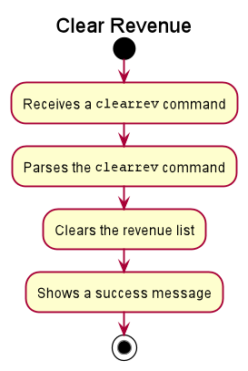
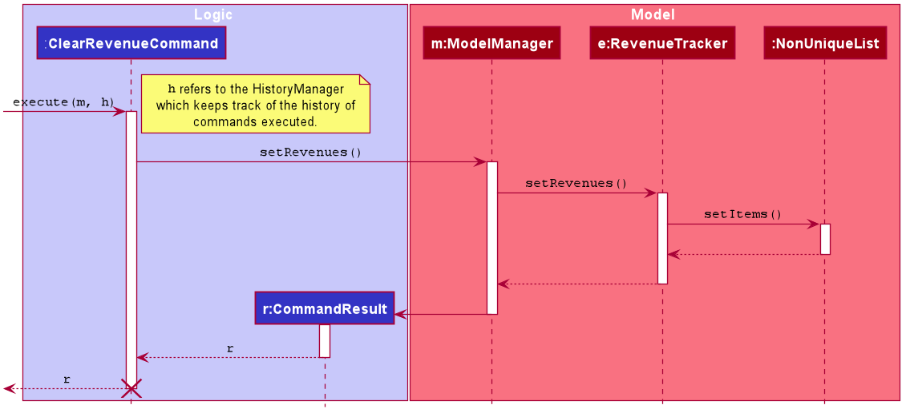
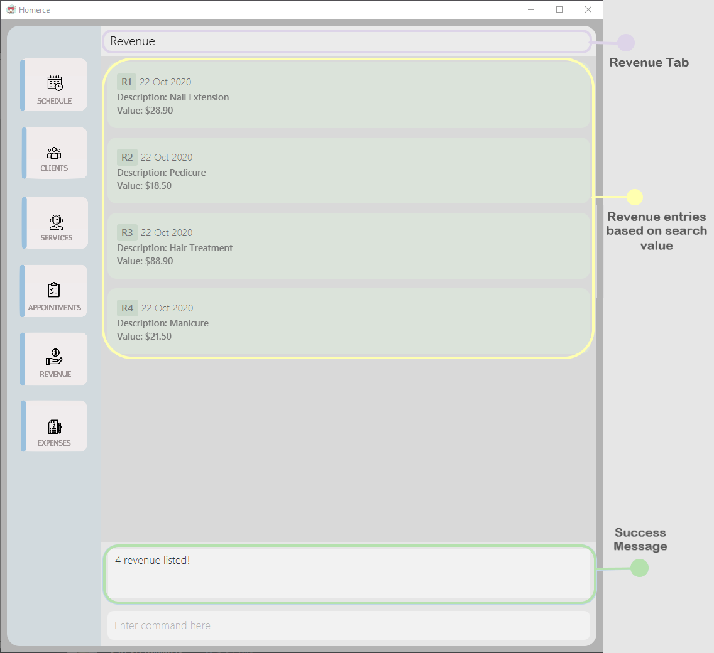

## Project: Homerce
Homerce is an all-in-one application that helps home-based beauty salon owners consolidate their business details - 
such as their schedule, appointments, clients, and services - into a single application. It also keeps track of the business's
revenue and expenses, and supports simple visualization of monthly finances.
The application uses a Command Line Interface (CLI).

This portfolio aims to document the contributions that I have made to Homerce.
Click [here](https://nus-cs2103-ay2021s1.github.io/tp-dashboard/#breakdown=true&search=galvinleow&sort=groupTitle&sortWithin=title&since=2020-08-14&timeframe=commit&mergegroup=&groupSelect=groupByRepos&checkedFileTypes=docs~functional-code~test-code~other&tabOpen=true&tabType=authorship&zFR=false&tabAuthor=galvinleow&tabRepo=AY2021S1-CS2103T-W13-3%2Ftp%5Bmaster%5D&authorshipIsMergeGroup=false&authorshipFileTypes=docs~functional-code~test-code)
to view Galvin Leow's code contributions.

**Enhancement Implemented**  
A summary of the enhancements you implemented.

<u>1. Implementation of Revenue Tracker</u>  
Revenue Tracker was implemented as it is an essential part of operating a business. Revenue tracking is bonded to the breakdown finance feature, 
in which this feature gives useful insights to the user.

1. The creation of 4 user-facing commands and they are the `findrev`, `sortrev`,`list` and `clearrev` commands. (Pull Request [#122](https://github.com/AY2021S1-CS2103T-W13-3/tp/pull/122))
    1. `findrev` command will enable the user to find revenues by date or by service code. (Issue [#120](https://github.com/AY2021S1-CS2103T-W13-3/tp/issues/120))
    1. `sortrev` command will sort the revenue list in descending or ascending order based on the user's input. (Issue [#193](https://github.com/AY2021S1-CS2103T-W13-3/tp/issues/193), Pull Request [#194](https://github.com/AY2021S1-CS2103T-W13-3/tp/pull/194))
    1. `listrev`command will list all revenue entries in the revenue list. (Issue [#119](https://github.com/AY2021S1-CS2103T-W13-3/tp/issues/119))
    1. `clearev`command will clear all revenue entries in the revenue list.
2. The creation of 2 backend capabilities that is used by the appointment manager.
    1. Appointment manager will be able to use the method to add revenue into the revenue list when its appointment is done. (Issue [#98](https://github.com/AY2021S1-CS2103T-W13-3/tp/issues/98))
    1. Appointment manager will be able to use the method to delete revenue into the revenue list when its appointment is undone.

All features built will include the implementation of the components from _Logic_, _Storage_ and _Model_.

<u>2. Testing</u>  
1. Included JUnit Test for Revenue Tracker, with over 90% line of code coverage on average.  (Issue [#208](https://github.com/AY2021S1-CS2103T-W13-3/tp/issues/208), [#366](https://github.com/AY2021S1-CS2103T-W13-3/tp/issues/366), Pull Request [#209](https://github.com/AY2021S1-CS2103T-W13-3/tp/pull/209), [#365](https://github.com/AY2021S1-CS2103T-W13-3/tp/pull/365))
    1. Included Integration Tests across logic, model and storage components for the Revenue Tracker.
1. Create test cases to be tested from the GUI.
1. Conduct session to test from GUI.

**Contributions to documentation**  
Section of which contributions were made in the documentation.

<u>User Guide</u>  
1. Structure of the documentation.  (Pull Request [#44](https://github.com/AY2021S1-CS2103T-W13-3/tp/pull/44))
1. Terminology related to the GUI - the creation of the _AnnotatedUI_ image. (Pull Request [#313](https://github.com/AY2021S1-CS2103T-W13-3/tp/pull/313))
1. General symbols and syntax - consolidating and documenting.
1. Revenue Tracker 
    1. Revenue Tracker Command Parameters section. 
    1. Commands documentation.
    1. Screenshot images for commands' outcome. (Pull Request [#313](https://github.com/AY2021S1-CS2103T-W13-3/tp/pull/313))
1. Command summary - the revenue tracker commands table.

<u>Developer Guide</u>  
1. Implementation - Revenue Tracker (Pull Request [#313](https://github.com/AY2021S1-CS2103T-W13-3/tp/pull/313))
    1. Rationale.
    1. Sort & Clear revenue command
        1. Current implementation
            1. Activity diagram included.
            1. Sequence diagram included.
        1. Design consideration

1. Use cases (Pull Request [#176](https://github.com/AY2021S1-CS2103T-W13-3/tp/pull/176) , Issue [#175](https://github.com/AY2021S1-CS2103T-W13-3/tp/issues/175))
    1. `Add`, `Edit` and `Delete` use cases were created for _Service_, _Client_, _Appointment_, _Revenue_ and _Expense_.
    1. `Done` and `Undone` use cases were created for _Appointment_.
    
**Contributions to team-based tasks**
1. Maintaining the issue tracker - ensure that issues are up-to-date and PR are linked correctly. (Issue [#76](https://github.com/AY2021S1-CS2103T-W13-3/tp/issues/76))
1. Update config file (Pull request [#46](https://github.com/AY2021S1-CS2103T-W13-3/tp/pull/46))
1. Helping my teammate fix their branch when they make a mistake in committing and merging which issues when wanting to create a pull request.

<div style="page-break-after: always;"></div>

### Contribution to the documentation (Extracts)
Reproduce of the parts in the guides that I have contributed. 
The contributions listed in this section will not be extensive, 
please refer to the respective documents for the full contributions.

**Developer Guide**

<u>Diagrams</u>  


_Figure 1. One of the activity diagrams that was added to the guide_



_Figure 2. One of the sequence diagrams that was added to the guide_

<u>Contents</u>
```
When the user enters the `clearrev` command to sort the revenue list, the user input command undergoes the same command parsing as described in
[Section 3.3 Logic Component](#33-logic-component). During the execution of `ClearRevenueCommand`, Homerce will access the revenue tracker
and clear the revenue list. For example, if there are 5 entries in the list, all the revenues will be cleared.

The following steps will describe the execution of the `ClearRevenueCommand` in detail, assuming that no errors are encountered.
1. When the `execute()` method of the `ClearRevenueCommand` is called, the `ModelManager`'s `setRevenues()` method is called.
1. The `RevenueTracker` then calls the `setItems()` method on `NonUniqueList`, which set the revenue entries in the revenue list.
1. The `ObservableList` of revenues is updated to reflect the newly sorted list.
1. The `Ui` component will detect this change and update the GUI.
1. Assuming that the above steps are all successful, the `ClearRevenueCommand` will then create a `CommandResult` object and return the result.
```

_Extract 1. Part of the implementation content for `ClearRevenueCommand`._

<pre>
UC005: Appointment Done
Indicate that the appointment have been done.

<b>System: Homerce</b>

<b>Actor: User</b>

<b>Preconditions: Appointment exists in appointment list.</b>

<b>Guarantees: Appointment indicated as done.</b>

<b>MSS</b>
1. User requests to list all appointments.
2. Homerce shows a list of appointments.
3. User requests to mark a specific appointment as done.
4. Homerce indicate that the appointment have been completed.
5. Homerce <ins>adds a revenue (UC027)</ins>.
6. Homerce displays all appointments in the appointment list.
7. Homerce displays a successful listed message.

<b>Extensions</b>
3a. Invalid index provided.
  3a1. Homerce displays an error message.
  Use case ends.
</pre>

_Extract 2. One of the use case for Appointment._

**User Guide**

<u>Diagram</u>


_Figure 3. One of the outcome screenshot that was added to the guide_

<u>Content</u>
<pre>
You can use this command to list all your revenue entries in Homerce. The list will be sorted by descending chronological order.

Format : `listrev`

Example :

You wish to list your revenues to view all the earnings that you currently have.

You can follow the steps below to list your all your revenue entries.

Steps :
1. Type `listrev` in the <i>Command Box</i>.
2. Press `Enter` to execute. 

Outcome : 
1. The <i>Result Display</i> will show a success message.
2. Homerce will list out all your revenue entries in the <i>Revenue</i> tab.
3. You can now see all your revenues sort by descending chronological order.
</pre>

_Extract 3. One of the feature command content._
