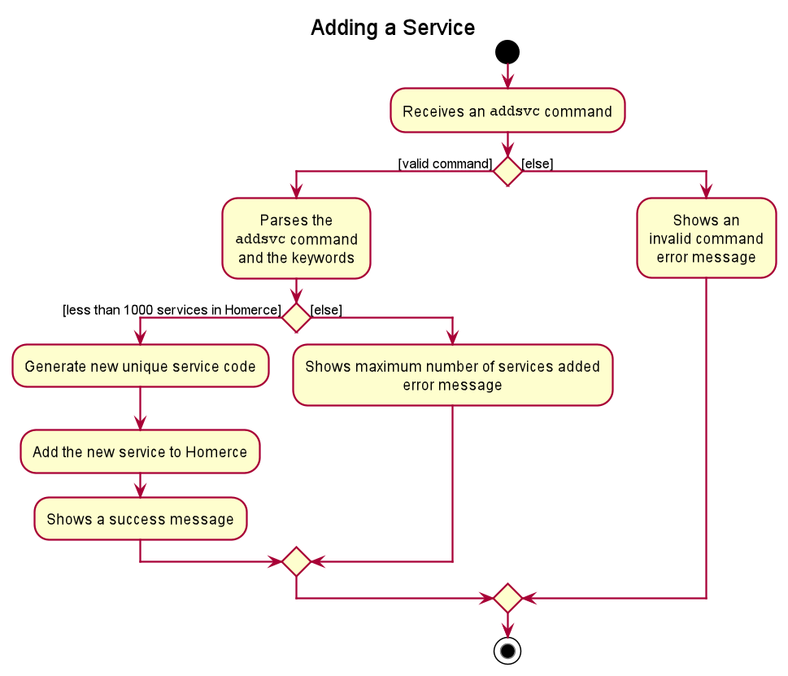
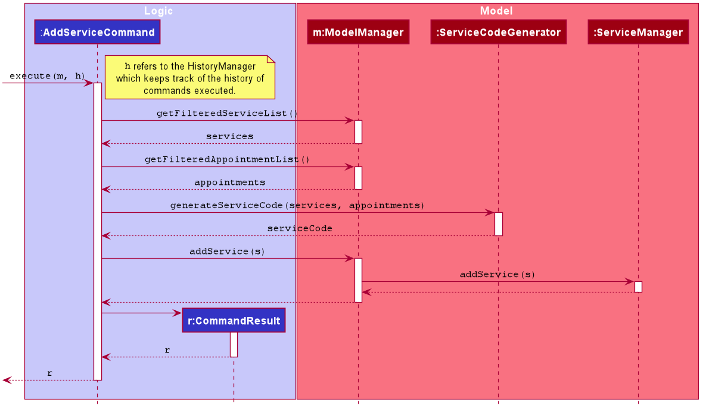

### Project: Homerce
Homerce is an all-in-one application that helps home-based beauty salon owners consolidate their business details - 
such as their schedule, appointments, clients, and services - into a single application. It also keeps track of the business's
revenue and expenses, and supports simple visualization of monthly finances.
The application uses a Command Line Interface (CLI).

This portfolio aims to document the contributions that I have made to Homerce. In this project, our team - Homerce,
will enhance a basic CLI Address Book 3 (AB3) and repurpose it to create our application: Homerce.

#### Summary of contributions

Click [here](https://nus-cs2103-ay2021s1.github.io/tp-dashboard/#breakdown=true&search=&sort=groupTitle&sortWithin=title&since=2020-08-14&timeframe=commit&mergegroup=&groupSelect=groupByRepos&checkedFileTypes=docs~functional-code~test-code~other&tabOpen=true&tabType=authorship&tabAuthor=hansebastian&tabRepo=AY2021S1-CS2103T-W13-3%2Ftp%5Bmaster%5D&authorshipIsMergeGroup=false&authorshipFileTypes=docs~functional-code~test-code)
to view Hans' code contributions.

**Enhancements Implemented:**
Here is a summary of the enhancements that I have implemented.

<u>1. Implementation of Service Manager</u>
The service manager was implemented to help users keep manage all the services that their home-based beauty salon provides. These services are used to create appointments with clients.

1. Implementation of 5 basic commands (Pull Request [#88](https://github.com/AY2021S1-CS2103T-W13-3/tp/pull/88), [#94](https://github.com/AY2021S1-CS2103T-W13-3/tp/pull/94), [#95](https://github.com/AY2021S1-CS2103T-W13-3/tp/pull/95),
 [#103](https://github.com/AY2021S1-CS2103T-W13-3/tp/pull/103), [#104](https://github.com/AY2021S1-CS2103T-W13-3/tp/pull/104))
    * `addsvc` command to add a service to the service manager
    * `editsvc` command to edit a service in the service manager
    * `deletesvc` command to delete a service from the service manager
    * `listsvc` command to display a list of all services in the service manager
    * `clearsvc` command to clear all the services from the service manager

1. Additional commands for extra functionality
    * `findsvc` command to find a specific set services based on the service code or title attribute (Pull Request [#105](https://github.com/AY2021S1-CS2103T-W13-3/tp/pull/105))

1. Implementation of service code generation<br>
    * Implemented a feature to automatically generate service codes for the services added, so that users do not have to manually add a service code for
    each service added. (Pull Request [#150](https://github.com/AY2021S1-CS2103T-W13-3/tp/pull/150))
    * For example, when the user adds the first service to the service manager, the first service will have a service code of "SCOOO" automatically
    generated and assigned to that service.

<u>2. Implementation of undo Feature</u>
The undo feature was implemented to allow the user to easily recover from command mistakes that they make, giving them a better user experience when using Homerce. (Pull Request [#151](https://github.com/AY2021S1-CS2103T-W13-3/tp/pull/151))

All the above features include the implementation of components from __Logic__, __Storage__, and __Model__.

<u>3. Enhancement of GUI</u>
1. Created the Service Card and Service Panel for Service Manager GUI (Pull Request [#88](https://github.com/AY2021S1-CS2103T-W13-3/tp/pull/88))
1. Created the GUI for `breakdownfinance` window (Pull Request [#189](https://github.com/AY2021S1-CS2103T-W13-3/tp/pull/189))

<u>4. Testing</u>
1. Included JUnit Tests for the Service Manager, Service attributes with over 90% line coverage on average (Pull Request [#195](https://github.com/AY2021S1-CS2103T-W13-3/tp/pull/195))
1. Included Integration Tests across logic, model and storage components for the Service Manager (Pull Request [#225](https://github.com/AY2021S1-CS2103T-W13-3/tp/pull/225))
1. Included JUnit Tests for History Manager, and undo command (Pull Request [#222](https://github.com/AY2021S1-CS2103T-W13-3/tp/pull/222))
1. Direct testing from GUI

<u>5. Others</u>
1. Contributed to team-tasks such as setting up of GitHub team organization and repository and managing the releases of some versions of Homerce.

_Contributions to User Guide:_
Command parameter summary table, commands documentation, including parameters, command format, examples, outcomes, and summary with annotated screenshots for:
1. Service Manager (Pull Request [#62](https://github.com/AY2021S1-CS2103T-W13-3/tp/pull/62), [#324](https://github.com/AY2021S1-CS2103T-W13-3/tp/pull/324))
1. Schedule Viewer and Financial Overview Feature (Pull Request [#211](https://github.com/AY2021S1-CS2103T-W13-3/tp/pull/211))
1. Undo Feature (Pull Request [#173](https://github.com/AY2021S1-CS2103T-W13-3/tp/pull/173))

_Contributions to Developer Guide:_
Rationale, current implementation, design considerations and UML diagrams for the following portions:
1. List Manager and List Tracker (Pull Request [#171](https://github.com/AY2021S1-CS2103T-W13-3/tp/pull/171))
1. Service Manager (Pull Request [#219](https://github.com/AY2021S1-CS2103T-W13-3/tp/pull/219))
1. Finance Breakdown (Pull Request [#219](https://github.com/AY2021S1-CS2103T-W13-3/tp/pull/219))

##### Contributions to documentation (Extracts)
The contributions listed in this section will not be extensive, please refer to the respective documents for the full contributions.

**Developer Guide**

<u>Diagrams</u>


_Figure 1. Activity Diagram for `sortexp` command_



_Figure 2. Sequence Diagram for `sortexp` command_

```
When the user enters the `addsvc` command to add a new service, the user input command undergoes the same command parsing as described in 
Section 3.3 Logic Component. During the execution of `AddServiceCommand`, Homerce will check the existing service codes from the
services in both the list of services and appointments. From the existing list of service codes, Homerce will then generate the
next smallest service code ranging from "SC000" to "SC999". For example, if Homerce already has an existing list of services from the service or appointments list  with
service codes "SC000", "SC001", and "SC005", the next service code generated during the execution of `AddServiceCommand` would be
"SC002".

The following steps will describe the execution of the `AddServiceCommand` in detail, assuming that no errors are encountered.
1. When the `execute()` method of the `AddServiceCommand` is called, the `ModelManager`'s `getFilteredServiceList()` and `getFilteredAppointmentList()` method are called.
2. The `ModelManager` will return a list of services and appointments provided by Homerce to the `AddServiceCommand`.
3. The `ServiceCodeGenerator` will use the list of services and appointments provided and call the `generateServiceCode()` method.
4. The `ServiceCodeGenerator` will return a unique service code, which is assigned to the service being added.
5. The `Model` is updated to include the newly added service by calling the `addService()` method of the `ModelManager`, which proceeds to call the `addService()` method of the `ServiceManager`.
6. The `Ui` component will detect this change and update the GUI.
7. Assuming that the above steps are all successful, the `AddServiceCommand` will then create a `CommandResult` object and return the result.
```

_Extract 1. Description of Sequence Diagram for the `addsvc` command_

**User Guide**

```
#### 4.2.2. Add a new service: `addsvc`

You can use this command to add a new service into the Service Manager.

Format: `addsvc t/TITLE du/DURATION p/PRICE`

<div markdown="block" class="alert alert-info">

**:information_source: Note:**<br>
 
* Refer to [Service Management Command Parameters](#421-service-management-command-parameters) for more details about each parameter.

</div>

Example:
Let's say you have a service with the following information you want to add into the Service Manager. You can follow these instructions.

Adding the above service:
1. Type `addsvc t/Microdermabrasion du/2.0 p/68` into the *Command Box*.
2. Press `Enter` to execute.

Outcome:
1. The *Result Display* will show success message.
2. Homerce will switch to the *Services Tab*.
3. You can now see all your services including the newly added service.

```
_Extract 2. `addsvc` command description_
