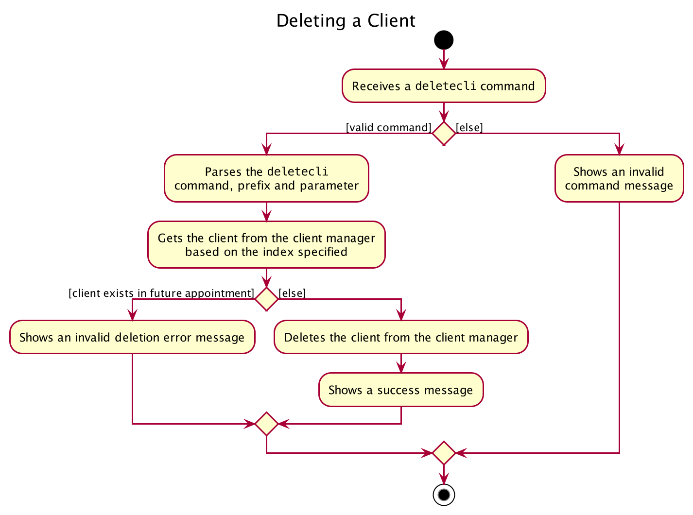
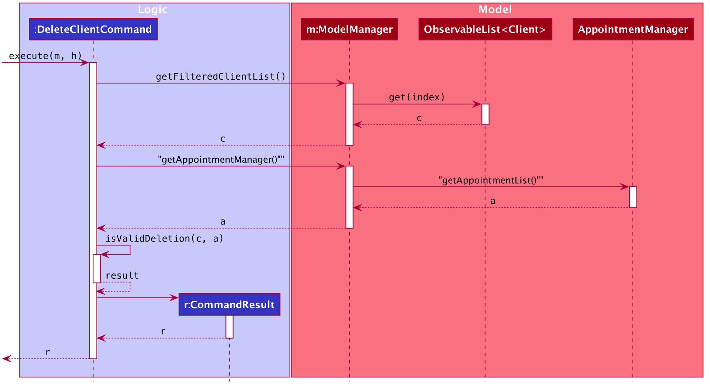

### Project: Homerce
Homerce is an all-in-one application that helps home-based beauty salon owners consolidate their business details - 
such as their schedule, appointments, clients, and services - into a single application. It also keeps track of the business's
revenue and expenses, and supports simple visualization of monthly finances.
The application uses a Command Line Interface (CLI).

This portfolio aims to document the contributions that I have made to Homerce. In this project, our team - Homerce,
will enhance a basic CLI Address Book 3 (AB3) and repurpose it to create our application: Homerce.

Click [here](https://nus-cs2103-ay2021s1.github.io/tp-dashboard/#breakdown=true&search=&sort=groupTitle&sortWithin=title&since=2020-08-14&timeframe=commit&mergegroup=&groupSelect=groupByRepos&checkedFileTypes=docs~functional-code~test-code~other&tabOpen=true&tabType=authorship&tabAuthor=RuiFengg&tabRepo=AY2021S1-CS2103T-W13-3%2Ftp%5Bmaster%5D&authorshipIsMergeGroup=false&authorshipFileTypes=docs~functional-code~test-code)
to view Rui Feng's code contributions.

**Enhancements Implemented:** <br>
A summary of the enhancements you implemented.

<u>Refactoring of project </u> <br>
1. Refactoring the Person class to Client class (Pull Request [#67](https://github.com/AY2021S1-CS2103T-W13-3/tp/pull/67))
    * Renamed all instances of person in addressbook to client
    * Removed the address field of a client
    * Updated Command names to correspond with the client class Pull Request [#110](https://github.com/AY2021S1-CS2103T-W13-3/tp/pull/110)
    * Set up the skeletal structure of the project (Pull Request [#49](https://github.com/AY2021S1-CS2103T-W13-3/tp/pull/49))
    
2. Removing instances of AddressBook 
    * Renaming of project package name to homerce  (Pull Request [#149](https://github.com/AY2021S1-CS2103T-W13-3/tp/pull/149)
    * Replaced AddressBook implementation with ClientManager, a component of Homerce (Pull Request [#132](https://github.com/AY2021S1-CS2103T-W13-3/tp/pull/132) 

4. Updating the original delete, edit, find and clear commands
    * Delete and clear commands for clients will take into account whether a client is scheduled in an upcoming appointment (Pull Request [#311](https://github.com/AY2021S1-CS2103T-W13-3/tp/pull/311), Pull Request [#296](https://github.com/AY2021S1-CS2103T-W13-3/tp/pull/296))
    * Find command for clients will include prefixes allowing users to search using name or phone (Pull Request [#136](https://github.com/AY2021S1-CS2103T-W13-3/tp/pull/136), Pull Request [#299](https://github.com/AY2021S1-CS2103T-W13-3/tp/pull/299))
    * Edit command for clients will update the client in an appointment as well (Pull Request [#296](https://github.com/AY2021S1-CS2103T-W13-3/tp/pull/296))
    
<u> Enhancement of GUI </u> <br>

1. Linked up the client, expense, appointment, revenue, service and schedule components to the GUI (Pull Request [#137](https://github.com/AY2021S1-CS2103T-W13-3/tp/pull/137))

2. Created the schedule view of appointments for Homerce (Pull Request [#181](https://github.com/AY2021S1-CS2103T-W13-3/tp/pull/181))

3. Enhanced the UI of the schedule view, side tab bar and background of Homerce to match with the UI mockup (Pull Request [#214](https://github.com/AY2021S1-CS2103T-W13-3/tp/pull/214), Pull Request [#230](https://github.com/AY2021S1-CS2103T-W13-3/tp/pull/230))

<u>Testing </u>

1. Included JUnit Tests for the Client Manager, with over 90% line coverage on average (Pull Request [#207](https://github.com/AY2021S1-CS2103T-W13-3/tp/pull/207))

2. Included Integration Tests across logic, model and storage components for the Expense Tracker (Pull Request [#207](https://github.com/AY2021S1-CS2103T-W13-3/tp/pull/207))

3. Direct testing from GUI

<u> Others </u> <br>

1. Helped resolve a non-trivial merge conflict (Pull Request [#130](https://github.com/AY2021S1-CS2103T-W13-3/tp/pull/130))

**Contributions to User Guide:** <br>
1. Client Manager (Pull Request [#185](https://github.com/AY2021S1-CS2103T-W13-3/tp/pull/185))
    * Command Parameter Summary Table
    * Commands Documentation, including command parameters, command format, command examples
    * Command Summary 

**Contributions to Developer Guide:** <br>
1. Client Manager (Pull Request [#328](https://github.com/AY2021S1-CS2103T-W13-3/tp/pull/328))
    * Rationale
    * Current implementation
    * Activity Diagram for `findcli` command
    * Sequence Diagram for `findcli` command
    * Activity Diagram for `deletecli` command
    * Sequence Diagram for `deletecli` command
    * Design considerations for `findcli` and `deletecli` commands

**Contributions to documentation (Extracts)**
The contributions listed in this section will not be extensive, please refer to the respective documents for the full contributions.

**Developer Guide**

<u>Diagrams</u>


_Figure 1. Activity Diagram for `deletecli` command_



_Figure 2. Sequence Diagram for `deletecli` command_

```
When the user enters the `deletecli` command to delete a client from the client list, the user input command undergoes the same command parsing as described in
[Section 3.3 Logic Component](#33-logic-component). During the execution of `DeleteClientCommand`, Homerce will access the client manager
and delete the client based on the index specified by the user. 

The following steps will describe the execution of the `DeleteClientCommand` in detail, assuming that no errors are encountered.
1. When the `execute()` method of the `DeleteClientCommand` is called, the `Model`'s `getFilteredClientList()` method is called.
2. The `get()` method of the `ObservableList` is called returning the client at the `index` specifed by the user.
3. The list of appointments gets retrieved from by calling the `getAppointmentList` method of the `AppointmentManager`
4. The `isValidDeletion` method of the `DeleteClientCommand` is called to check if the client specified by index is scheduled in an upcoming appointment
    * If the client is scheduled in an upcoming appointment, a `CommandException` is thrown
    * If the client is not scheduled in an upominga appointment, the `DeleteClientCommand` returns a `CommandResult` with a success message
```
_Extract 1. Description of Sequence Diagram for the `deletecli' command_

```
**Aspect: DeleteClientCommand implementation**

|              | **Pros**   | **Cons** |
| -------------|-------------| -----|
| **Option 1** <br> Deleting a client scheduled in an upcoming appointment would delete the corresponding appointment as well | More convenient for the user | Introduces more coupling between an appointment and a client and might create more bugs. Also might result in unwanted outcomes for the user.  |
| **Option 2 (current choice)** <br> Allow users to delete a client only if the client is not scheduled in an upcoming appointment. | Easier to implement and reduces coupling. User will be clearer of the expected outcome as well. | If the user wants to delete a client scheduled in an upcoming appointment he/she must delete that appointment first making it a bit more troublesome for the user. |

Reason for choosing option 2:
* It is good coding practice to reduce the amount of coupling between classes
* It will be clearly communicate to the user what he/she can and cannot when deleting a client.
```

_Extract 2. Design Consideration for `deletecli` command_
